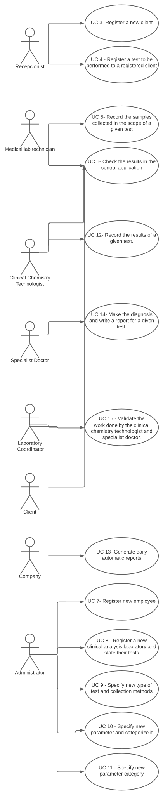

# Use Case Diagram (UCD)

**In the scope of this project, there is a direct relationship of _1 to 1_ between Use Cases (UC) and User Stories (US).**

However, be aware, this is a pedagogical simplification. On further projects and curricular units might also exist _1 to N **and/or** N to 1 relationships between US and UC.

**Insert below the Use Case Diagram in a SVG format**

**For each UC/US, it must be provided evidences of applying main activities of the software development process (requirements, analysis, design, tests and code). Gather those evidences on a separate file for each UC/US and set up a link as suggested below.**

# Use Cases / User Stories
| UC/US  | Description                                                               |                   
|:----|:------------------------------------------------------------------------|
| US1 | As a client, I want to access the application to view the results of the tests I have performed |
| US2 | As a client, I want to update my personal data |
| US3 | As a receptionist of the laboratory, I want to register a client. |
| US4 | As a receptionist of the laboratory, I intend to register a test to be performed to a registered client |
| US5 | As a medical lab technician, I want to record the samples collected in the scope of a given test |
| US6 | As a client, a medical lab technician, a clinical chemistry technologist, a specialist doctor, a laboratory coordinator, I want to check the results in the central application |
| US7 | As an administrator, I want to register a new employee. |
| US8 | As an administrator, I want to register a new Clinical Analysis Laboratory |
| US9 | As an administrator, I want to specify a new type of test and its collecting methods. |
| US10 | As an administrator, I want to specify a new parameter and categorize it. |
| US11 | As an administrator, I want to specify a new parameter category. |
| US12 | As a clinical chemistry technologist, I intend to record the results of a given test. |
| US13 | As a clinical chemistry technologist, I intend to consult the historical tests performed by a particular client and to be able to check tests details/results. |
| US14 | As a specialist doctor, I intend to make the diagnosis and write a report for a given test. |
| US15 | As a laboratory coordinator, I want to validate the work done by the clinical chemistry technologist and specialist doctor. |
| US16 | As a laboratory coordinator, I want to have an overview of all the tests performed by Many Labs and analyse the overall performance of the company  |
| US17 | As a laboratory coordinator, I want to import clinical tests from a CSV file |
| US18 | As an Administrator I want to send the Covid-19 report to the NHS at any time. I want to define the interval of dates to fit the regression model, the number of historical points (number of days or number of weeks) that must be sent to the NHS, the regression model to use and select the independent variables to use.  |
| US19 | The Many Labs company wants to send to the NHS daily reports of Covid-19 data, including the number of observed values and estimated values |
