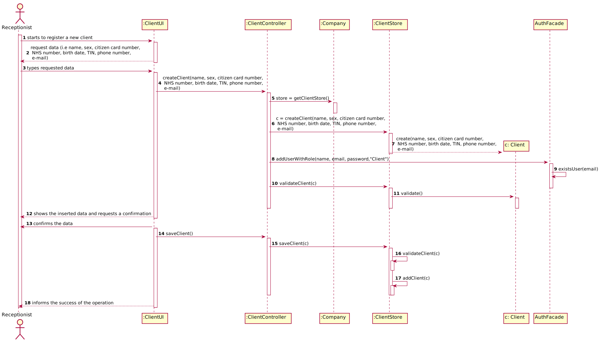

# US 003 - Register a Client

## 1. Requirements Engineering

The receptionist starts registering a new client. The system
requests the required data. The receptionist
types the requested data. The system validates and presents the data to the
receptionist, asking her/him to confirm. The receptionist confirms. The system
records the data and informs the receptionist of the operation’s success.
 

### 1.1. User Story Description

As a receptionist of the laboratory, I want to register a client.

### 1.2. Customer Specifications and Clarifications 

**From the client clarifications:**

> **Question:** Does the receptionist need to be logged in the app to perform the regist?
>  
> **Answer:** Yes

-

> **Question:** What parameter (asked by the receptionist) should the system use to create the password of the new client?
>  
> **Answer:** The password should be randomly generated. It should have ten alphanumeric characters.

### 1.3. Acceptance Criteria

* AC1: Password must have 10 alphanumeric characters.
* AC2: The receptionist must be logged in the app.
* AC3: The client must become a system user. 
* AC4: The "auth" component available on the repository must be reused (without modifications).
* AC5: All fields required. The sex is opcional.
* AC6: Citizen Card Number should be a 16 digit number.
* AC7: NHS Number should be a 10 digit number.
* AC8: TIN Number should be a 10 digit number.
* AC9: Birth Date should be in DD/MM/YYYY format.
* AC10: Sex should only have the Male/Female options.
* AC11: Phone Number should have a 11 digit number. 
* AC12: Name should be 35 characters long.

### 1.4. Found out Dependencies

There were none found.

### 1.5 Input and Output Data

**Input Data:**

* Typed data:
	* name
	* sex
	* citizen card number
	* NHS number
	* birth date
	* TIN
	* phone number
	* e-mail
	
* Selected data:
	* (none)

**Output Data:**

   * (In)Success of the operation

### 1.6. System Sequence Diagram (SSD)

### 1.7 Other Relevant Remarks

* This US is always used when registering a new client in the company

## 2. OO Analysis

### 2.1. Relevant Domain Model Excerpt 

### 2.2. Other Remarks

n/a

## 3. Design - User Story Realization 

### 3.1. Rationale

**The rationale grounds on the SSD interactions and the identified input/output data.**

| Interaction ID | Question: Which class is responsible for... | Answer  | Justification (with patterns)  |
|:-------------  |:--------------------- |:------------|:---------------------------- |
| Step 1  		 |	...interacting with the actor? | ClientUI  |   There is no reason to assign this to any other class. |
|				 |  ...coordinating the US? | ClientController | Controller |
|                |  ...registering a new client? | Company | 
| Step 2  		 |							 |             |                              |
| Step 3  		 |	... validating all data (local validation)? | Client | Owns its data.
| Step 4  		 |							 |             |                              |
| Step 5   		 |	... validating all data (global validation)? | Company | Knows all clients | 
| 			 |	... saving the client? | Company | The client was registered in the Company | 
| Step 6  		 |	... informing operation success?| ClientUI  | Responsible for user interactions.  |       

### Systematization ##

According to the taken rationale, the conceptual classes promoted to software classes are: 

 * Company
 * Client

Other software classes (i.e. Pure Fabrication) identified: 

 * ClientUI  
 * ClientController

## 3.2. Sequence Diagram (SD)

## 3.3. Class Diagram (CD)

# 4. Tests 
*In this section, it is suggested to systematize how the tests were designed to allow a correct measurement of requirements fulfilling.* 

**_DO NOT COPY ALL DEVELOPED TESTS HERE_**

**Test 1:** Validates a client created
	
	@Test
	void validateClient() {
        ClientStore i = new ClientStore();
        boolean expValue = true;
        Client c = new Client("ana","female",Long.parseLong("1234123412341234"),1234123412,"23/6/1998",1223123412,Long.parseLong("12341234123"),"ana@gmail.com");
        assertEquals(expValue,i.validateClient(c));
    }
    
**Test 2:** Validates the client attributes

   @Test
    public void getName() {
        assertNotNull(o2.getName());
        assertNull(o.getName());
    }

    @Test
    public void getEmail() {
        assertNotNull(o2.getEmail());
        assertNull(o.getEmail());
    }

    @Test
    public void getCitizenCardNumber() {
        assertNotNull(o2.getCitizenCardNumber());
    }

    @Test
    public void getNhsNumber() {
        assertNotNull(o2.getNhsNumber());
    }

    @Test
    public void getPhoneNumber() {
        assertNotNull(o2.getPhoneNumber());
    }

    @Test
    public void getTin() {
        assertNotNull(o2.getTin());
    }

    @Test
    public void getBirthDate() {
        assertNotNull(o2.getBirthDate());
        assertNull(o.getBirthDate());
    }

    @Test
    public void getSex() {
        assertNull(o.getSex());
        assertNotNull(o2.getSex());
    }

# 5. Construction (Implementation)

**Class ClientController**

	public boolean createClient(String name, String sex, double citizenCardNumber, double nhsNumber, String birthDate, double tin, double phoneNumber, String email){
        this.c = this.manyLabs.getStore().createClient(name, sex, citizenCardNumber, nhsNumber, birthDate, tin, phoneNumber, email);
        return this.manyLabs.getStore().validateClient(c);
    }
	
	public boolean saveClient(){
        return this.manyLabs.getStore().saveClient(c);
    }
    
    public boolean addUserWithRole(String name,String email, String password, String roleId){
        return this.auth.addUserWithRole(name,email,password,roleId);
    }
	
**Class ClientStore**
	
	public Client createClient(String name, String sex, double citizenCardNumber, double nhsNumber, String birthDate, double tin, double phoneNumber, String email){
        return new Client(name, sex, citizenCardNumber, nhsNumber, birthDate, tin, phoneNumber, email);
    }
	
	 public boolean validateClient(Client c) {
        if (c == null)
            return false;
        for (Client x : Company.getClients()){
            if(c.getPhoneNumber()==x.getPhoneNumber()){
                throw new IllegalArgumentException("This client has the same phone number as another client. Make sure it was written properly.");
            }
        }
        return ! Company.getClients().contains(c);
    }
	
	public boolean saveClient(Client c) {
        if (!validateClient(c))
            return false;
        return Company.getClients().add(c);
    }

# 6. Integration and Demo 

* A new option in the Receptionist menu was added (Register a new Client).

* Client role is added while the system starts

# 7. Observations

The validate section in the Class ClientStore should need more for parameters for validation. But they are validated in the UI.

