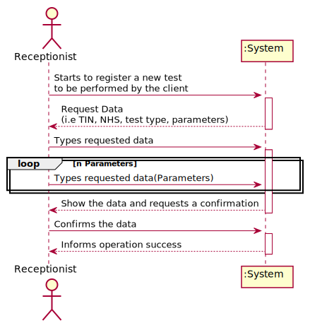
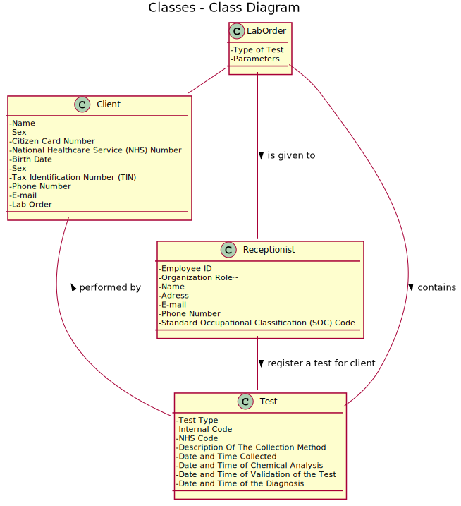
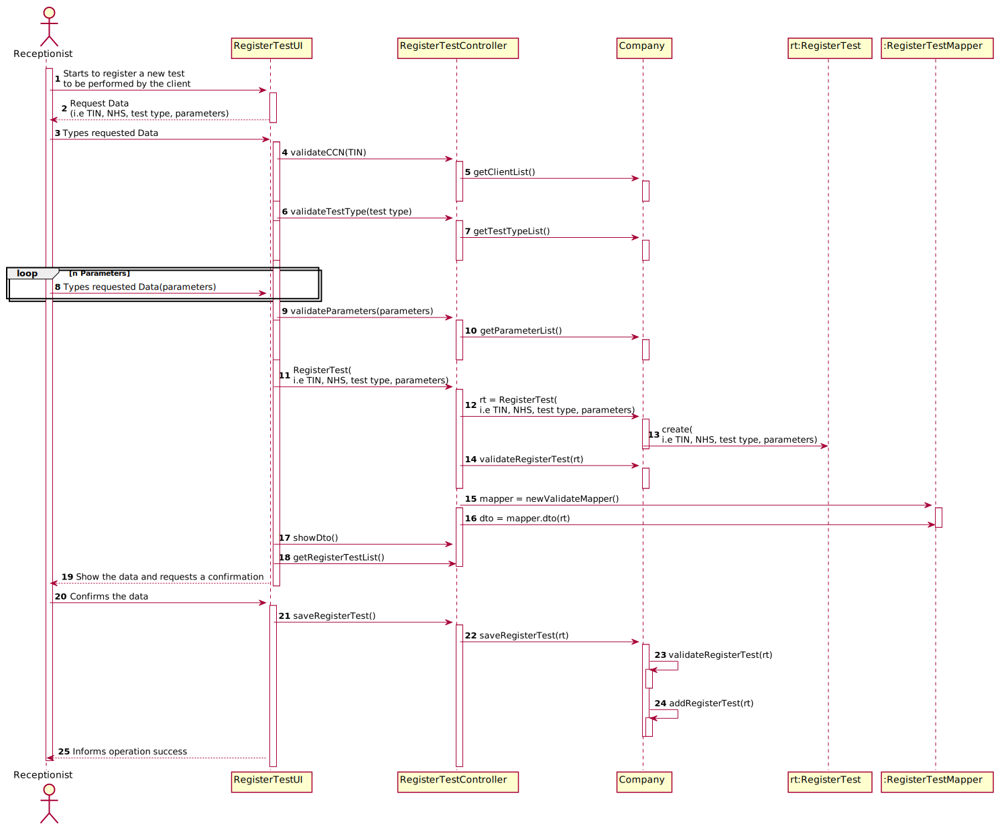
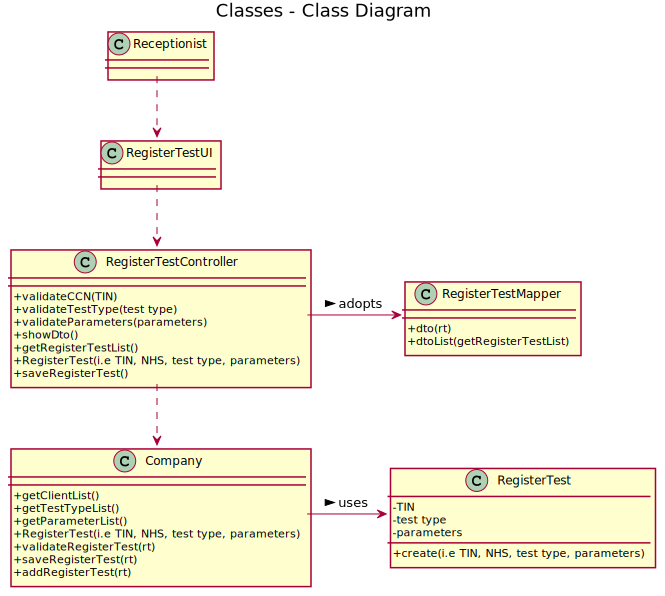

# US 004 - To create a test for Client

## 1. Requirements Engineering

### 1.1. User Story Description 

As a receptionist of the laboratory, I intend to register a test to be performed to a
registered client.

### 1.2. Customer Specifications and Clarifications

**From the specifications document:**

> Client should wait until a medical lab technician calls him/her to collect the samples required to perform a given test.

**From the client clarifications:**
> **Question:** How is it possible to know in which laboratory the test is being registered? Should the Receptionist select the Laboratory before selecting the Test Type?
>  
> **Answer:** After login the receptionist should select the laboratory where she is working. Then, the receptionist has access to the system's features/functionalities.

-

> **Question:** Shouldn't the receptionist locate the Client by the Citizen Card Number instead of TIN Number?
>  
> **Answer:** The receptionist should use the TIN number to find the client.

-

> **Question:** You've said on previous questions that the NHS code contains 12 characters and is alphanumeric, so this will be different from the NHS number from the client, am I right? If so, how do we know a certain test is associated to a client?
>  
> **Answer:** A test has a NHS code and a client has a NHS number. In US4 the receptionist of the laboratory should ask the client to get his TIN number. Using the TIN number the receptionist of the laboratory can find all information about the client. Do not forget that a client should be registered in the system to make a test.

-

> **Question:** Can the client have two identical tests? or the system should stop from creating the same test?
>  
> **Answer:** A test is unique in the system.

-

> **Question:**  I wanted to ask if the NHS code of which test is unique or not.
>  
> **Answer:** Yes.

-

### 1.3. Acceptance Criteria

* **AC1:** All required fiels must be filled in.
* **AC2:** The receptionist must select the parameters to be analysed from all possible parameters in accordance with the test type.
* **AC3:** When creating a test to be preformed for the Client with an already existing reference, the system must reject such operation and the Receptionist 
must have the change or modify the typed reference.

### 1.4. Found out Dependencies

* There is a dependency to "US003 Register a Client" since at least a Client must exist to assign the test to be performed by him.

### 1.5 Input and Output Data

**Input Data:**

* Typed data:
	* a TIN number, 
	* a test type, 
	* parameters

* Output Data:
	* (In)Success of the operation

### 1.6. System Sequence Diagram (SSD)

### 1.7 Other Relevant Remarks

* This user story is used everytime the Receptionist wants to register a test to be preformed by the client, knowing that the client must be registered on the app and he must be in possess of a lab order.

## 2. OO Analysis

### 2.1. Relevant Domain Model Excerpt

### 2.2. Other Remarks

n/a

## 3. Design - User Story Realization 

### 3.1. Rationale

| Interaction ID | Question: Which class is responsible for... | Answer  | Justification (with patterns)  |
|:-------------  |:--------------------- |:------------|:---------------------------- |
| Step 1  		 |	... interacting with the actor? | RegisterTestUI   |  There is no reason to assign this responsibility to any existing class in the Domain Model.           |
| 			  		 |	... coordinating the US? | RegisterTestController | Controller                             |
| 			  		 | ... registering a test for a client?  | Company  |   |
| 			  		 |							 | Company  | knows its own data |
| Step 2  		 |							 |             |                              |
| Step 3  		 |	...knowing the Parameters to show? | Platform  | Lab Order will have all data |
| Step 4  		 |	... saving the selected test assigned to a client? |    | object created is classified in one container.  |
| Step 5  		 |							 |             |                              |              
| Step 6  		 |	... validating all data (local validation)? | RegisterTestStore | owns its data.| 
| 			  		 |	... validating all data (global validation)? | Company | knows all its tasks.| 
| 			  		 |	... saving the created task? | RegisterTestStore | owns all its tasks.| 
| Step 7 		 |	... informing operation success?| RegisterTestUI  | is responsible for user interactions.  | 

### Systematization ##

According to the taken rationale, the conceptual classes promoted to software classes are:

 * Company
 * RegisterTest
 * Plataform

Other software classes (i.e. Pure Fabrication) identified:

 * RegisterTestUI  
 * RegisterTestController
 * RegisterTestStore

## 3.2. Sequence Diagram (SD)

## 3.3. Class Diagram (CD)

# 4. Tests 

**Test 1:** Validates the creation of the object. 

	public RegisterTestTest(){
        parameterList.add(new Parameter("BLOOD","blood","blood"));
        test = new RegisterTest(null,Long.parseLong(ccn),null,null,null);
        test2 = new RegisterTest(parameterList,Long.parseLong(ccn),new TypeOfTest("blood","blood","blood"),"123456789121","123456789121");
    	}
    	@Test
    	public void setCCN() {
        	test.setCCN(Long.parseLong(ccn));
        	assertEquals(Long.parseLong(ccn),test.getCCN());
    	}

    	@Test
    	public void setData() {
        	test.setData();
        	Date date = test.getData();
        	assertEquals(date,test.getData());
    	}

    	@Test
    	public void getTestnumber() {
        	assertNull(test.getTestnumber());
        	assertNotNull(test2.getTestnumber());
    	}

    	@Test
    	public void setNhs() {
        	test2.setNhs("123456789");
        	assertEquals("123456789",test2.getNhs());
    	}

    	@Test
    	public void setParametersList() {
        	assertNull(test.getTestnumber());
        	assertNotNull(test2.getTestnumber());
    	}

    	@Test
    	public void getParametersList() {
        	assertNull(test.getParametersList());
        	assertNotNull(test2.getParametersList());
    	}

    	@Test
    	public void getCCN() {
        	test.setCCN(Long.parseLong(ccn));
        	assertEquals(Long.parseLong(ccn),test.getCCN());
    	}

    	@Test
    	public void getNhs() {
        	assertNull(test.getNhs());
        	assertNotNull(test2.getNhs());
    	}

    	@Test
    	public void setTestnumber() {
        	test.setTestnumber("1234");
        	assertEquals("1234",test.getTestnumber());
    	}

    	@Test
    	public void getData() {
        	test.setData();
        	Date date = test.getData();
        	assertEquals(date,test.getData());
        	assertNotNull(date);
    	}

    	@Test
    	public void getTypeOfTest() {
        	assertNull(test.getTypeOfTest());
        	assertNotNull(test2.getTypeOfTest());
    	}
	

**Test 2:** Validates if test is saved correctly

    	@Test
    	public void saveRegisterTest() {
        	rtc.RegisterTest(Long.parseLong(ccn),parameterList,new TypeOfTest("blood","blood","blood"),"123456781828");
        	assertTrue(rtc.saveRegisterTest());
    	}
	

**Test 3:** Validates if coorect lengths and correct data types

	@Test
    	public void validateNHS() {
        	String nhsTrue = "123456789121";
        	String nhsFalse= "123";
        	assertTrue(RegisterTestUI.validateNHS(nhsTrue));
        	assertFalse(RegisterTestUI.validateNHS(nhsFalse));

    	}

    	@Test
    	public void validateLong() {
        	String nhsTrue = "123456789121";
        	String nhsFalse= "monkey";
        	assertTrue(RegisterTestUI.validateLong(nhsTrue));
        	assertFalse(RegisterTestUI.validateLong(nhsFalse));
    	}

    	@Test
    	public void removeParameter() {
        	List<Parameter> parameterList = new ArrayList<>();
        	parameterList.add(new Parameter("blood","blood","blood"));
        	assertEquals(0,RegisterTestUI.RemoveParameter(parameterList,0).size());
    	}

    	@Test
    	public void validateCCN() {
        	long ccn = Long.parseLong("1234567812345678");
        	assertFalse(RegisterTestUI.validateCCN(ccn));
    	}

    	@Test
    	public void validateCCN2() {
        	long ccnTrue = Long.parseLong("1234567812");
        	long ccnFalse = Long.parseLong("12345678123456");
        	assertTrue(RegisterTestUI.validateCCN2(ccnTrue));
        	assertFalse(RegisterTestUI.validateCCN2(ccnFalse));
    	}

    	@Test
    	public void validateNumber() {
        	assertFalse(RegisterTestUI.validateNumber(0));
        	assertTrue(RegisterTestUI.validateNumber(1));
    	}

# 5. Construction (Implementation)

## Class RegisterTestStore 

		public boolean saveRegisterTest() {
        		if (validateRegisterTestStore()) {
            			registerTestList.add(rt);
            			ValidateController.getWorkToBeValidatedList().add(new Validate(rt));
            			return true;
        		} else return false;
    		}

## Class RegisterTestController

		public boolean saveRegisterTest() {
        		if (company.getRegisterTestStore().validateRegisterTestStore()) {
            			company.getRegisterTestStore().saveRegisterTest();
            			soutConsole("[+]Test has been added successfully");
            			return true;
        		} else return false;
    		}

## Class RegisterTestMapper
		public List<RegisterTestdto> dtoList(List<RegisterTest> registerTestList) {
        		for (RegisterTest x : registerTestList) {
            			registerTestListdto.add(new RegisterTestdto(x.getParametersList(), x.getCCN(), x.getTypeOfTest(), x.getNhs(), x.getTestnumber()));
        		}
        		return registerTestListdto;
    		}

## Class RegisterTestdto
		public RegisterTestdto(List<Parameter> parametersList, long TIN, TypeOfTest test, String nhs, String testnumber) {
        		this.TIN = TIN;
        		this.parametersList = parametersList;
        		this.data = new Date();
        		this.test = test;
        		this.nhs = nhs;
        		this.testnumber = testnumber;
    		}

# 6. Integration and Demo 

* A new option on the Receptionist menu options was added.

* This code was merged with Receptionist menu.

# 7. Observations

US04 Will need the US03, to have acess to all clients and there information (citizen card number)