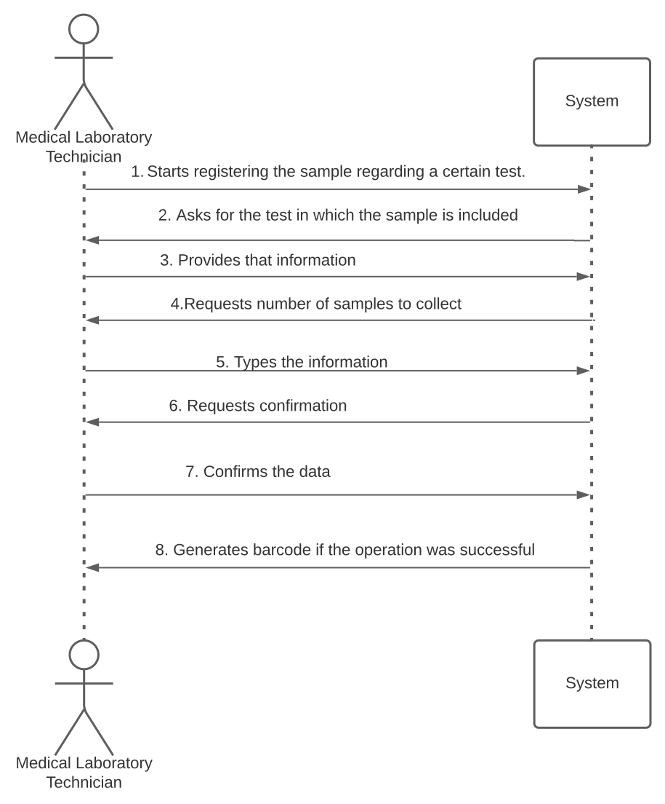
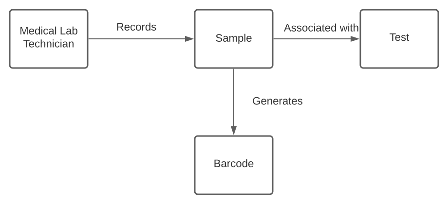
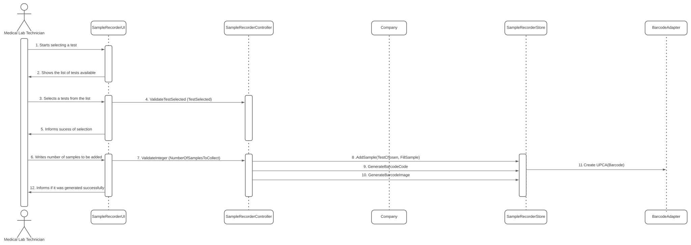
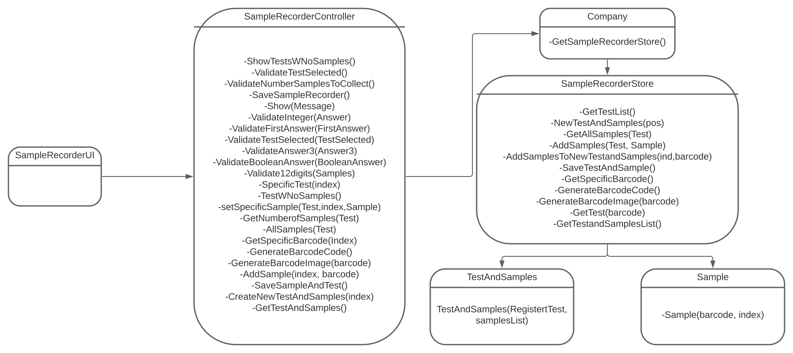

# US 05 - Record the samples being a medical lab technician

## 1. Requirements Engineering

In US5, the medical lab technician checks the system and see all tests for which there are no samples collected. The medical lab technician selects a test and the system asks for the number of samples to collect/record.
Then, the application generates barcodes (one or more). After printing the barcodes (one or more) the use case ends.

### 1.1. User Story Description

As a medical lab technician, I want to record the samples collected in the scope of a 
given test.

### 1.2. Customer Specifications and Clarifications 

"Each sample is associated with a test. A sample has only one attribute, a barcode number (UPC) that is a sequential number and is automatically generated by the system. Each sample has a unique barcode number."

### 1.3. Acceptance Criteria

Integer regarding the number of samples to collect.
Barcode has 12 digits.
### 1.4. Found out Dependencies

US05 is connected with US04 because to generate the barcode of the sample recorded, it is going to be needed the tests registered of the clients in the previous US.

### 1.5 Input and Output Data

Input:

Chosen test.
Number of samples to collect.

Output:
Barcode number (Sequential number generated by the system).

### 1.6. System Sequence Diagram (SSD)

### 1.7 Other Relevant Remarks

Although the client specified the samples being the only attribute of the test, I also made the number of samples a attribute, so that its easier for everyone involved to work

## 2. OO Analysis

### 2.1. Relevant Domain Model Excerpt 

### 2.2. Other Remarks

The tests on the diagram are relative to the previous US. The barcode is, as mentioned earlier, generated randomly.

## 3. Design - User Story Realization 

### 3.1. Rationale

**The rationale grounds on the SSD interactions and the identified input/output data.**

| Interaction ID | Question: Which class is responsible for... | Answer  | Justification (with patterns)  |
|:-------------  |:--------------------- |:------------|:---------------------------- |
| Step 1  		 |	Interacting with the user?				 | SampleRecorderUI            | User Interface is always designed to interact with the user                 |
|                        |      Coordinating the methods so that the UI can use them?    | SampleRecorderController    | The controller always has the methods ready for the UI to use them          |
|                        |      Recording a new sample?                                  | Company                     | Has all the data, so when occurs a change or a add, is the one to be used   |
| Step 2  		 |							         |                             |                                                                             |
| Step 3  		 |	Validating the test selected?		         	 | Company                     | Checks if the system contains the test in the database                      |
| Step 4  		 |	Registering a new Test?					 | TestandSamples              | Assigns the samples to a new Test, so its the most suitable                 |
| Step 5  		 |	Generating the barcode associated with the sample?	 | Company                     | As the samples are registered in Company, the barcode associated is as well |                           
| Step 6  		 |	Informing the operation sucess?				 | SampleRecorderUI            | Its the one who communicates with the user                                  |              

### Systematization ##

According to the taken rationale, the conceptual classes promoted to software classes are: 

-Company

 

Other software classes (i.e. Pure Fabrication) identified: 
- SampleRecorderUI
- SampleRecorderController

## 3.2. Sequence Diagram (SD)

## 3.3. Class Diagram (CD)

# 4. Tests 
	
Test 1: Validates if the answer introduced by the user is a integer or not. This will be helpful in the methods where a integer is mandatory, such as to choose the option pretended.

    @Test
    void validateInteger1() {
        String Integer1 = "33";
        boolean expresult = true;
        boolean result = instance.ValidateInteger(Integer1);
        assertEquals(expresult, result);
    }

Test 2: Validates if the answer introduced by the user is an integer and between the intervals of the options provided.

@Test
void validateFirstAnswer1() {
    String FirstAnswer1 = "1";
    boolean expresult = true;
    boolean result = instance.ValidateFirstAnswer(FirstAnswer1);
    assertEquals(expresult, result);
}

Test 3: Validates if the answer introduced by the user is an integer and between the interval of the test list provided.
 
@Test
void validateTestSelected1() {
    int RandomNumber = 2;
    int test = SampleRecorderStore.TestList.size() - RandomNumber;
    String TestSelected = valueOf(test);
    boolean result = instance.ValidateTestSelected(TestSelected, companySampleRecorder);
    assertFalse(result);
}

Test 4: Validates if the answer introduced by the user is an integer and between the intervals of the options provided.
 

@Test
void validateAnswer3first() {
    String Answer3 = valueOf(2);
    boolean expresult = true;
    boolean result = instance.ValidateAnswer3(Answer3);
    assertEquals(expresult, result);
}

Test 5: Validates if the answer introduced by the user is a boolean, either yes or no, even if the user writes it with any letters as capital letters.

@Test
void validateBooleanAnswer1() {
    String Teste = "Yes";
    boolean expresult = true;
    boolean result = instance.ValidateBooleanAnswer(Teste);
    assertEquals(expresult, result);
}

Test 6: Validates if the barcode provided is a integer and has 12 digits in it.

@Test
void validate12digits1() {
    String Teste = "123456789012";
    boolean expresult = true;
    boolean result = instance.Validate12digits(Teste);
    assertEquals(expresult, result);

}

# 5. Construction (Implementation)

 /**
     * Generates the barcode sequentially.
     *
     * @return the barcode generated.
     */
    public String generateBarcodeCode() {
        int length = 11;
        String barcode = "";
        int digit = 0;
        int aux = barcodeCounter;
        while(aux!=0){
            aux = aux/10;
            digit++;
        }
        int zerosLeft = length-digit;
        for(int i=0;i<zerosLeft;i++){
            barcode = barcode + 0;
        }
        barcode = barcode + barcodeCounter;
        barcodeCounter++;
        return barcode;
    }

    /**
     * Generates the barcode image.
     *
     * @param barcode generated.
     */
    public void generateBarcodeImage(String barcode) {
        BarcodeAdapter barcodeAdapter = Constants.BARCODE_MODULE;  //Testes para o barcode
        try {
            barcodeAdapter.createUPCA(barcode);
        } catch (BarcodeException | OutputException | IOException e) {
            e.printStackTrace();
        }
    }

    /**
     * Checks which test has the sample and the barcode introduced.
     *
     * @param barcode which the user wants to search.
     * @return test which the sample belongs.
     */
# 6. Integration and Demo 
 
- Another option when choosing a test was added, which was the possibility of changing a already existant sample, something not specified in the US requeriments, but to have a complete software, and provide the user with the most options possible, I decided to add it.

# 7. Observations

This US is connected with the fourth US, that has the test to register, as this US records the samples in these.