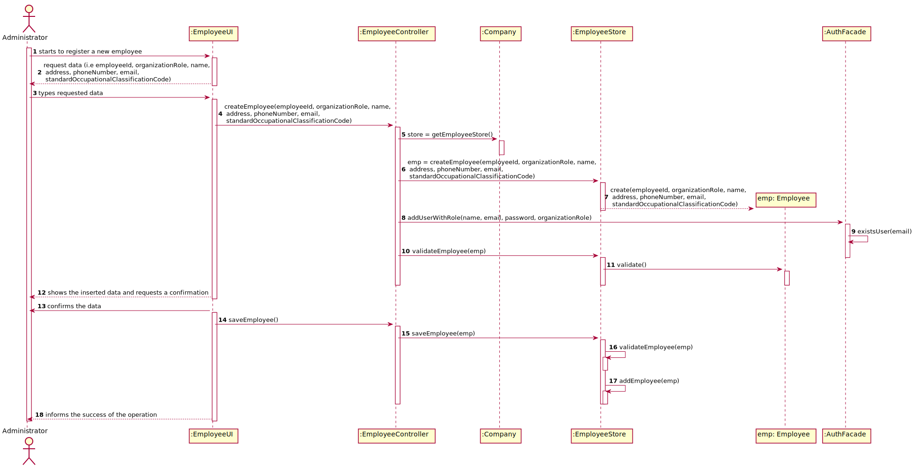
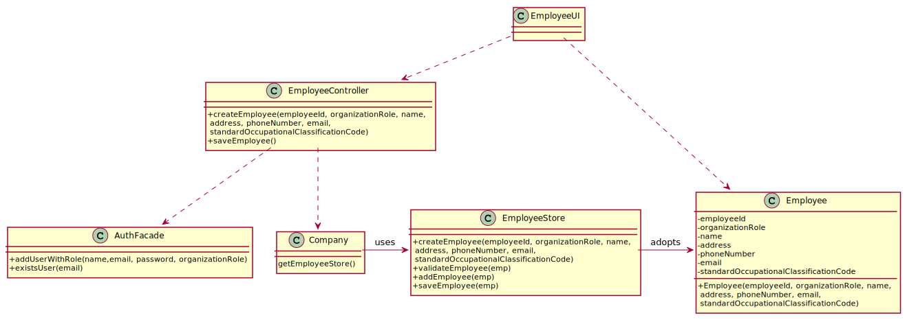

# US 007 - Register a New Employee

## 1. Requirements Engineering

The administrator starts by registering a new employee. The systems
requests the required data. The administrator types the requested data.
The system validates the data and asks for the administrator confirmation.
The administrator confirms the data. The system records the data and informs
the sucess of the operation.

### 1.1. User Story Description

As an administrator, I want to register a new employee.

### 1.2. Customer Specifications and Clarifications 

**From the client clarifications:**

> **Question:** : When creating a new employee, the attributes "Employee ID" and "Doctor Index Number", are implemented by the administrator or incremented by the system?
>  
> **Answer:** Only the employee ID should be generated from the initials of the employee name and should include a number. 
			  The number has 5 digits and is increases automatically when a new employee is registered in the system. 
			  For instance, if the company has 20 employees and wants to register a specialist doctor having the name Ana Maria Santos Moura, then the the employee ID for this specialist doctor should be AMSM00021. 

-

> **Question:** : Are there any other employee roles than the ones specified in the documents?
>  
> **Answer:** No

### 1.3. Acceptance Criteria

* AC1: Each user must have a single role definied in the system.
* AC2: The "auth" component available on the repository must be reused (without modifications).
* AC3: Password must have 10 alphanumeric characters.
* AC4: Each user must have a single role in the system.
* AC5: All fields required. The phone number is opcional.
* AC6: Phone Number should have a 11 digit number.
* AC7: Employee ID should be generated from the initials of the employee name and should include a 5 digit number corresponding to the number of registration in the company.
* AC8: SOC code is a 6 length digit number.
* AC9: Doctor Index Number is a 4 digit number.
* AC10: Name should be 35 characters long.
* AC11: Organization Role should be 15 characters long.

### 1.4. Found out Dependencies

   * There were none found.

### 1.5 Input and Output Data

**Input Data:**

* Typed data:
	* Organization Role
	* Name
	* Address
	* Phone Number
	* E-mail
	* Standard Occupational Classification (SOC) code
	
* Selected data:
	* (none)

**Output Data:**

   * (In)Success of the operation

### 1.6. System Sequence Diagram (SSD)

### 1.7 Other Relevant Remarks

* This US is always used when registering a new employee in the company

## 2. OO Analysis

### 2.1. Relevant Domain Model Excerpt 

### 2.2. Other Remarks

n/a

## 3. Design - User Story Realization 

### 3.1. Rationale

**The rationale grounds on the SSD interactions and the identified input/output data.**

| Interaction ID | Question: Which class is responsible for... | Answer  | Justification (with patterns)  |
|:-------------  |:--------------------- |:------------|:---------------------------- |
| Step 1  		 |	...interacting with the actor? | EmployeeUI  |   There is no reason to assign this to any other class. |
|				 |  ...coordinating the US? | EmployeeController | Controller |
|                |  ...registering a new employee? | Company | 
| Step 2  		 |							 |             |                              |
| Step 3  		 |	... validating all data (local validation)? | Employee | Owns its data.
| Step 4  		 |							 |             |                              |
| Step 5   		 |	... validating all data (global validation)? | Company | Knows all clients | 
| 			 |	... saving the employee? | Company | The client was registered in the Company | 
| Step 6  		 |	... informing operation success?| EmployeeUI  | Responsible for user interactions.  |       

### Systematization ##

According to the taken rationale, the conceptual classes promoted to software classes are: 

 * Company
 * Employee

Other software classes (i.e. Pure Fabrication) identified: 

 * EmployeeUI  
 * EmployeeController

## 3.2. Sequence Diagram (SD)

## 3.3. Class Diagram (CD)

# 4. Tests 
*In this section, it is suggested to systematize how the tests were designed to allow a correct measurement of requirements fulfilling.* 

**_DO NOT COPY ALL DEVELOPED TESTS HERE_**

**Test 1:** Check that it is not possible to create an Employee. 

	@Test
    void validateEmployee() {
        EmployeeStore e = new EmployeeStore();
        boolean expValue = true;
        Employee emp = new Employee("hector","hector@gmail.com",Long.parseLong("12341234123"),"Rua","Laboratory Coordinator",12);
        assertEquals(expValue,e.validateEmployee(emp));
    }
    
**Test 2:** Validates the attributes of the employee

   @Test
    public void getName() {
        String realResult = emp.getName();
        String expResult = "Joao";
        String name = null;
        assertNotNull(realResult);
        assertEquals(expResult, realResult);
        assertNull(name);
    }

    @Test
    public void getEmail() {
        String realResult = emp.getEmail();
        String expResult = "joao@gmail.com";
        String email = null;
        assertNotNull(realResult);
        assertEquals(expResult, realResult);
        assertNull(email);
    }

    @Test
    public void getAddress() {
        String realResult = emp.getAddress();
        String expResult = "Rua dos Corvos";
        String address = null;
        assertNotNull(realResult);
        assertEquals(expResult, realResult);
        assertNull(address);
    }

    @Test
    public void getEmployeeId() {
        String realResult = emp.getEmployeeId();
        String empId = null;
        assertNotNull(realResult);
        assertNull(empId);
    }

    @Test
    public void getDoctorIndexNumber() {
        int realResult = emp.getDoctorIndexNumber();
        int expResult = 223344;

        assertNotNull(realResult);
        assertEquals(expResult, realResult);
    }

    @Test
    public void getPhoneNumber() {
        long realResult = emp.getPhoneNumber();
        long expResult = Long.parseLong("12341234123");

        assertNotNull(realResult);
        assertEquals(expResult, realResult);
    }

    @Test
    public void getOrganizationRole() {
        String realResult = emp.getOrganizationRole();
        String expResult = "SPECIALDOC";
        String orgId = null;
        assertNotNull(realResult);
        assertEquals(expResult, realResult);
        assertNull(orgId);
    }

*It is also recommended to organize this content by subsections.* 

# 5. Construction (Implementation)

**Class EmployeeController**
	
	 public boolean CreateEmployee(String name, String email, long phoneNumber, String address, String organizationRole, int standardOcupationalCode) {
        this.emp = this.manyLabs.getEmployeeStore().Employee(name, email, phoneNumber, address, organizationRole, standardOcupationalCode);
        return this.manyLabs.getEmployeeStore().validateEmployee(emp);
    }
	
	 public boolean saveEmployee() {
        return this.manyLabs.getEmployeeStore().saveEmployee(emp);
    }
	
**Class EmployeeStore**

	 public Employee Employee(String name, String email, long phoneNumber, String address, String organizationRole, int standardOcupationalCode) {
        return new Employee(name, email, phoneNumber, address, organizationRole, standardOcupationalCode);
    }
	
	public boolean validateEmployee(Employee emp) {
        if (emp == null) {
            return false;
        }
        for (Employee x : Company.getEmployees()) {
            if (emp.getPhoneNumber() == x.getPhoneNumber()) {
                System.out.println("This employee has the same phone number as another employee. Make sure it was written properly.");
                return false;
            }
        }
        return !Company.getEmployees().contains(emp);

    }
	
	public boolean saveEmployee(Employee emp) {
        if (!validateEmployee(emp)) {
            return false;
        }
        return Company.getEmployees().add(emp);
    }

# 6. Integration and Demo 

* A new option in the administrator menu has been added.

* All roles are added in the system has it starts.

# 7. Observations

