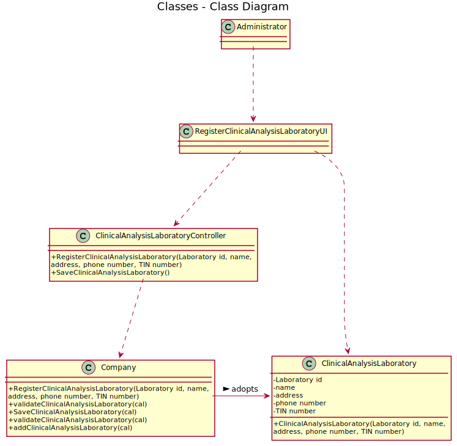

# US 008 - Register Clinical Analysis Laboratory

## 1. Requirements Engineering

### 1.1. User Story Description

As an administrator, I want to register a new clinical analysis laboratory stating which
kind of test(s) it operates.

### 1.2. Customer Specifications and Clarifications 

* Q: The administrator needs to be logged in to execute his role?
* A: Yes.

* Q: Which type/format has LaboratoryID, address, name, phone number, and TIN number on Clinical Analysis Laboratory?
* A: Each Clinical Analysis Laboratory is characterized by the following attributes:
* Laboratory ID: five alphanumeric characters;
* Name: A string with no more than 20 characters;
* Address: A string with no more than 30 characters;
* Phone Number: 11 digit number;
* TIN number: 10 digit number;
* Type of tests performed by the lab.

### 1.3. Acceptance Criteria

* **AC1:** All required fiels must be filled in.
* **AC2:** When registering a Clinical Analysis Laboratory, the system must detect if it already exist and reject 
    those specific Clinical Analysis Laboratory, giving an option to the administrator fill the input fields again.
* **AC3:** The administrator needs to be logged in to execute his role.
* **AC4:** TIN should be a 10 digit number.
* **AC5:** Phone number should be a 11 digit number.
* **AC6:**  Lboratory ID is a five alphanumeric characters.
* **AC7:**  Address is a string with no more than 30 characters.
* **AC8:**  Name is a string with no more than 20 characters.

### 1.4. Found out Dependencies

* n/a

### 1.5 Input and Output Data

**Input Data:**
* Typed data:
    * a Laboratory id
    * a name
    * an address
    * a phone number
    * a TIN number
    * a test type
* Selected data:
    * Classifying Clinical Analysis Laboratory to register
    
**Output Data:**
* (In)Success of the operation

### 1.6. System Sequence Diagram (SSD)

### 1.7 Other Relevant Remarks

* This user story is used everytime the administrator wants to register a Clinical Analysis Laboratory.

## 2. OO Analysis

### 2.1. Relevant Domain Model Excerpt 

### 2.2. Other Remarks

n/a

## 3. Design - User Story Realization 

### 3.1. Rationale

| Interaction ID | Question: Which class is responsible for... | Answer  | Justification (with patterns)  |
|:-------------  |:--------------------- |:------------|:---------------------------- |
| Step 1  		 |... interacting with the actor?   | RegisterClinicalAnalysisLaboratoryUI   | There is no reason to assign this to any other class.|
|        		 |... coordinating the US?	 | ClinicalAnalysisLaboratoryController   | Controller                                                  |
|        		 |...registering a new Clinical Analysis Laboratory?   | Company      |                              |
| Step 2  		 |							 |             |                              |
| Step 3  		 |... validating all data (global validation)   | Company    | Knows all Clinical Analysis Laboratory               |
|        		 |... saving the Clinical Analysis Laboratory?	| Company            | The Clinical Analysis Laboratory was registered in the Company            |
| Step 4  		 |... informing operation success?| RegisterClinicalAnalysisLaboratoryUI | |

### Systematization ##

According to the taken rationale, the conceptual classes promoted to software classes are: 

 * Company
 * Administrator
 * Platform

Other software classes (i.e. Pure Fabrication) identified: 
 * RegisterClinicalAnalysisLaboratoryUI
 * ClinicalAnalysisLaboratoryController

## 3.2. Sequence Diagram (SD)

## 3.3. Class Diagram (CD)

# 4. Tests 

**Test 1:** Check that its not possible to save repeated clinical analysis laboratory. 

	@Test
    void validateClinicalAnalysisLaboratory() {
        List<String> testArr = new ArrayList<>();
        List<ClinicalAnalysisLaboratory> calStore = new ArrayList<>();
        testArr.add("labExam");
        testArr.add("labExam2");
        ClinicalAnalysisLaboratoryStore testStore = new ClinicalAnalysisLaboratoryStore();
        testStore.RegisterClinicalAnalysisLaboratory("abcd1","a","a",Long.parseLong("91827364542"),Long.parseLong("9182736454"),testArr);
        assertTrue(testStore.SaveClinicalAnalysisLaboratory());
        testStore.RegisterClinicalAnalysisLaboratory("abcd2","b","b",Long.parseLong("91827364542"),Long.parseLong("9182736454"),testArr);
        assertTrue(testStore.SaveClinicalAnalysisLaboratory());
        testStore.RegisterClinicalAnalysisLaboratory("abcd1","a","a",Long.parseLong("91827364542"),Long.parseLong("9182736454"),testArr);
        System.out.println(testStore.getClinical());
        assertFalse(testStore.SaveClinicalAnalysisLaboratory());
    }

**Test 2:** Check that its not possible to input anything else than the requested input with the specific requirements.

    @Test
    void laboratoryUIRemoveValidate() {
        int n = 1;
        int n2 = 0;
        int n3 = 12;
        int n4 = -1;
        List<String> testArr = new ArrayList<>();
        testArr.add("labExam");
        testArr.add("labExam2");
        ClinicalAnalysisLaboratory test = new ClinicalAnalysisLaboratory("abcd1","a","a",Long.parseLong("91827364542"),Long.parseLong("9182736454"),testArr);
        ClinicalAnalysisLaboratory test2 = new ClinicalAnalysisLaboratory("abcd2","b","b",Long.parseLong("91827364542"),Long.parseLong("9182736454"),testArr);
        ClinicalAnalysisLaboratory test3 = new ClinicalAnalysisLaboratory("abcd3","c","c",Long.parseLong("91827364542"),Long.parseLong("9182736454"),testArr);
        List<ClinicalAnalysisLaboratory> list = new ArrayList<>();
        list.add(test);
        list.add(test2);
        list.add(test3);
        assertTrue(RegisterClinicalAnalysisLaboratoryUI.laboratoryUIRemoveValidate(n,list));
        assertFalse(RegisterClinicalAnalysisLaboratoryUI.laboratoryUIRemoveValidate(n2,list));
        assertFalse(RegisterClinicalAnalysisLaboratoryUI.laboratoryUIRemoveValidate(n3,list));
        assertFalse(RegisterClinicalAnalysisLaboratoryUI.laboratoryUIRemoveValidate(n4,list));
    }
    @Test
    void laboratoryIdValidate() {
        String laboratoryId = "";
        String laboratoryId2 = "abcd1";
        String laboratoryId3 = "ab";
        String laboratoryId4 = "   ";
        assertFalse(RegisterClinicalAnalysisLaboratoryUI.laboratoryIdValidate(laboratoryId));
        assertTrue(RegisterClinicalAnalysisLaboratoryUI.laboratoryIdValidate(laboratoryId2));
        assertFalse(RegisterClinicalAnalysisLaboratoryUI.laboratoryIdValidate(laboratoryId3));
        assertFalse(RegisterClinicalAnalysisLaboratoryUI.laboratoryIdValidate(laboratoryId4));
    }
    @Test
    void nameValidate() {
        String name = "";
        String name2 = "Rua do Carvalhal 23";
        String name3 = "Rua do Carvalhal 23 3ºd test test test tedst test testst test test";
        String name4 = "   ";
        assertFalse(RegisterClinicalAnalysisLaboratoryUI.nameValidate(name));
        assertTrue(RegisterClinicalAnalysisLaboratoryUI.nameValidate(name2));
        assertFalse(RegisterClinicalAnalysisLaboratoryUI.nameValidate(name3));
        assertFalse(RegisterClinicalAnalysisLaboratoryUI.nameValidate(name4));
    }
    @Test
    void adressValidate() {
        String adress = "";
        String adress2 = "Rua do Carvalhal 23 3ºd";
        String adress3 = "Rua do Carvalhal 23 3ºd test test test tedst test testst test test";
        String adress4 = "   ";
        assertFalse(RegisterClinicalAnalysisLaboratoryUI.adressValidate(adress));
        assertTrue(RegisterClinicalAnalysisLaboratoryUI.adressValidate(adress2));
        assertFalse(RegisterClinicalAnalysisLaboratoryUI.adressValidate(adress3));
        assertFalse(RegisterClinicalAnalysisLaboratoryUI.adressValidate(adress4));
    }
    @Test
    void phoneNumberValidate() {
        String phoneNumber="-12345678912";
        String phoneNumber2="91234567819";
        long phoneNumber3=0;
        assertFalse(RegisterClinicalAnalysisLaboratoryUI.phoneNumberValidate(Long.parseLong(phoneNumber)));
        assertTrue(RegisterClinicalAnalysisLaboratoryUI.phoneNumberValidate(Long.parseLong(phoneNumber2)));
        assertFalse(RegisterClinicalAnalysisLaboratoryUI.phoneNumberValidate(phoneNumber3));
    }
    @Test
    void tinValidate() {
        long tin=-1234567892;
        long tin2=1234567891;
        long tin3 = 0;
        assertFalse(RegisterClinicalAnalysisLaboratoryUI.tinValidate(tin));
        assertTrue(RegisterClinicalAnalysisLaboratoryUI.tinValidate(tin2));
        assertFalse(RegisterClinicalAnalysisLaboratoryUI.tinValidate(tin3));
    }
**Test 3:** Check for mutations (null returns).

    @Test
    public void getLaboratoryId() {
        String phoneNumber = "98989878675";
        String tin = "9898987867";
        List<TypeOfTest> test = new ArrayList<>();
        test.add(new TypeOfTest("agdfg","a","a"));
        ClinicalAnalysisLaboratory o = new ClinicalAnalysisLaboratory("abcd1","a","a",Long.parseLong(phoneNumber),Long.parseLong(tin),test);
        ClinicalAnalysisLaboratory o2 = new ClinicalAnalysisLaboratory(null,"a","a",Long.parseLong(phoneNumber),Long.parseLong(tin),test);
        assertNotNull(o.getLaboratoryId());
        assertNull(o2.getLaboratoryId());
    }

    @Test
    public void getName() {
        String phoneNumber = "98989878675";
        String tin = "9898987867";
        List<TypeOfTest> test = new ArrayList<>();
        test.add(new TypeOfTest("agdfg","a","a"));
        ClinicalAnalysisLaboratory o = new ClinicalAnalysisLaboratory("abcd1","a","a",Long.parseLong(phoneNumber),Long.parseLong(tin),test);
        ClinicalAnalysisLaboratory o2 = new ClinicalAnalysisLaboratory("abcd1",null,"a",Long.parseLong(phoneNumber),Long.parseLong(tin),test);
        assertNotNull(o.getName());
        assertNull(o2.getName());
    }

    @Test
    public void getAdress() {
        String phoneNumber = "98989878675";
        String tin = "9898987867";
        List<TypeOfTest> test = new ArrayList<>();
        test.add(new TypeOfTest("agdfg","a","a"));
        ClinicalAnalysisLaboratory o = new ClinicalAnalysisLaboratory("abcd1","a","a",Long.parseLong(phoneNumber),Long.parseLong(tin),test);
        assertNotNull(o.getAdress());
    }

    @Test
    public void getPhoneNumber() {
        String phoneNumber = "98989878675";
        String tin = "9898987867";
        List<TypeOfTest> test = new ArrayList<>();
        test.add(new TypeOfTest("agdfg","a","a"));
        ClinicalAnalysisLaboratory o = new ClinicalAnalysisLaboratory("abcd1","a","a",Long.parseLong(phoneNumber),Long.parseLong(tin),test);
        ClinicalAnalysisLaboratory o2 = new ClinicalAnalysisLaboratory("abcd1","a","a",0,Long.parseLong(tin),test);
        assertNotNull(o.getPhoneNumber());
        assertEquals(0,o2.getPhoneNumber());
    }

    @Test
    public void getTin() {
        String phoneNumber = "98989878675";
        String tin = "9898987867";
        List<TypeOfTest> test = new ArrayList<>();
        test.add(new TypeOfTest("agdfg","a","a"));
        ClinicalAnalysisLaboratory o = new ClinicalAnalysisLaboratory("abcd1","a","a",Long.parseLong(phoneNumber),Long.parseLong(tin),test);
        ClinicalAnalysisLaboratory o2 = new ClinicalAnalysisLaboratory("abcd1","a","a",Long.parseLong(phoneNumber),0,test);
        assertNotNull(o.getTin());
        assertEquals(0,o2.getTin());
    }

    @Test
    public void getTestsType() {
        String phoneNumber = "98989878675";
        String tin = "9898987867";
        List<TypeOfTest> test = new ArrayList<>();
        test.add(new TypeOfTest("agdfg","a","a"));
        ClinicalAnalysisLaboratory o = new ClinicalAnalysisLaboratory("abcd1","a","a",Long.parseLong(phoneNumber),Long.parseLong(tin),test);
        ClinicalAnalysisLaboratory o2 = new ClinicalAnalysisLaboratory("abcd1","a","a",Long.parseLong(phoneNumber),Long.parseLong(tin),null);
        assertNull(o2.getTestsType());
        assertNotNull(o.getTestsType());
    }
    
# 5. Construction (Implementation)

## Class ClinicalAnalysisLaboratoryController 

    public boolean RegisterClinicalAnalysisLaboratory(String laboratoryId, String name, String adress, long phoneNumber, long tin, List<String/*testType*/> testsType) {
        cal = getLaboratory.getLaboratoryStore().RegisterClinicalAnalysisLaboratory(laboratoryId, name, adress, phoneNumber, tin, testsType);
        if(getLaboratory.getLaboratoryStore().validateClinicalAnalysisLaboratory()){
            System.out.println("Laboratory already exists");
        }
        else{
            System.out.println("Laboratory registered:");
        }
        return getLaboratory.getLaboratoryStore().validateClinicalAnalysisLaboratory();
    }
    public boolean SaveClinicalAnalysisLaboratory(){
        if(!getLaboratory.getLaboratoryStore().validateClinicalAnalysisLaboratory()){
            getLaboratory.getLaboratoryStore().SaveClinicalAnalysisLaboratory();
            System.out.println("Laboratory has been added successfully");
            return true;
        }
        return false;
    }
    public int ClinicalAnalysisLaboratoryCount(){
        return getLaboratory.getLaboratoryStore().getClinical().size();
    }
    public boolean ClinicalAnalysisLaboratoryRemove(int n){
        getLaboratory.getLaboratoryStore().getClinical().remove(n-1);
        return true;
    }
    

## Class ClinicalAnalysisLaboratoryStore

    public ClinicalAnalysisLaboratory RegisterClinicalAnalysisLaboratory(String laboratoryId, String name, String adress, long phoneNumber, long tin, List<String/*testType*/> testsType) {
        cal = new ClinicalAnalysisLaboratory(laboratoryId, name, adress, phoneNumber, tin, testsType);
        return cal;
    }
    public boolean validateClinicalAnalysisLaboratory() {
        int cont =0;
        for(ClinicalAnalysisLaboratory x : getClinical()){
            if(x.getLaboratoryId().equals(cal.getTin()))cont+=1;
        }
        return cont>0;
    }
    public boolean SaveClinicalAnalysisLaboratory() {
        if (validateClinicalAnalysisLaboratory()) {
            return false;
        } else {
            clinical.add(cal);
            return true;
        }
    }
   
   

# 6. Integration and Demo 

* A new option on the ClientAnalysisLaboratoryUI menu options was added.
* Some demo purposes some tasks are bootstrapped while system starts.

# 7. Observations

For now US08 will need US09 to provide the test types that admin add to the laboratory to the application run properly.