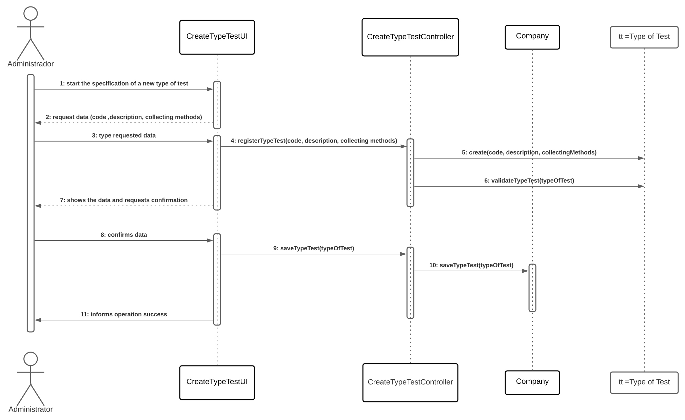

# US 009 - Specify type of test and its collecting methods

## 1. Requirements Engineering

The administrator should be able to create a new type of test specificating a code, a description and its collecting methods, the type of test should also have a set of categories, each chosen from a list of categories (eacho with a name and a unique code). The input the administrator should give is the name of the test, a code and its collecting methods along with the description, recieving a message of success or error if the type of test was created or not.

### 1.1. User Story Description

As an administrator, I want to specify a new type of test and its collecting methods.

### 1.2. Customer Specifications and Clarifications 

The test must have a code and a small description along with the collecting methods. The test types should also have a set of categories, each of them chosen from a list of categories (each category has a name and unique code).

### 1.3. Acceptance Criteria

- **AC1:** All required fields must be filled in.
- **AC2:** The code should have 5 alphanumeric characters and is not automatically generated.
- **AC3:** The description is a string with no more than 15 characters.
- **AC4:** The collecting method is a string with no more than 20 characters containing a description of the collecting method to identify it.
- **AC5:** The categories must be chosen from a list of categories and each should have a unique name and code.

### 1.4. Found out Dependencies

The US8 depends on this US because it operates with tests that are/can be specified in this US. This US also depends on US11 because the categories are specified in that US.

### 1.5 Input and Output Data

**Input Data:**

 * Typed Data:
	* Code
    * Description
    * Collecting method
	
* Selected data:
	* Category list

**Output Data:**

 * Success/Error message
 

### 1.6. System Sequence Diagram (SSD)

### 1.7 Other Relevant Remarks 

**i)**
 - There are no special requirementes

**ii)**
 - There are no data/technology variations
 
**iii)**
 - The US shouldn't be held more than twice

## 2. OO Analysis

### 2.1. Relevant Domain Model Excerpt 

### 2.2. Other Remarks

There are no other remarks

## 3. Design - User Story Realization 

### 3.1. Rationale

| Interaction ID | Question: Which class is responsible for... | Answer  | Justification (with patterns)  |
|:-------------  |:--------------------- |:------------|:---------------------------- |
| Step 1|...interacting with the administrator?|CreateTypeTestUI|This class is responsible for requests like this one, it acts as an intermediary|
||...coordinating the US?|CreateTypeTestController|It is the class' main function, controller|
||...register the type of test?|Company|The company registers the tests|
| Step 2||||
| Step 3|...validating the data given?|Administrator|Checks the data and verifies it|
| Step 4||||
| Step 5|...validating all data?|Company|Determines if the data is valid|
||...saving the data?|Company|Saves the types of tests that are given and confirmed by the admin and themselves|
| Step 6|...informing the success of the operation?|CreateTypeTestUI|Responsible for interacting with the administrator|

### Systematization ##

According to the taken rationale, the conceptual classes promoted to software classes are: 

 * Company

Other software classes (i.e. Pure Fabrication) identified: 

 * CreateTypeTestUI  
 * CreateTypeTestController
 * TypeOfTestStore

## 3.2. Sequence Diagram (SD)

## 3.3. Class Diagram (CD)

# 4. Tests 

**Test 1:** Checks if it is possible to create an instance with pretended data.

	@Test
    void validateTypeTest() {
        int expectedValue = 0;
        int realValue = TypeOfTest.validateTypeTest(new TypeOfTest("qwert", "Blood test", "With a needle"));
        assertEquals(expectedValue, realValue);
    }

# 5. Construction (Implementation)

The design was implemented with success altough some changes had to be made in order for it to become simpler and better, also some parts had to be added because of client's specifications.

# 6. Integration and Demo 

*In this section, it is suggested to describe the efforts made to integrate this functionality with the other features of the system.*

# 7. Observations

*In this section, it is suggested to present a critical perspective on the developed work, pointing, for example, to other alternatives and or future related work.*

