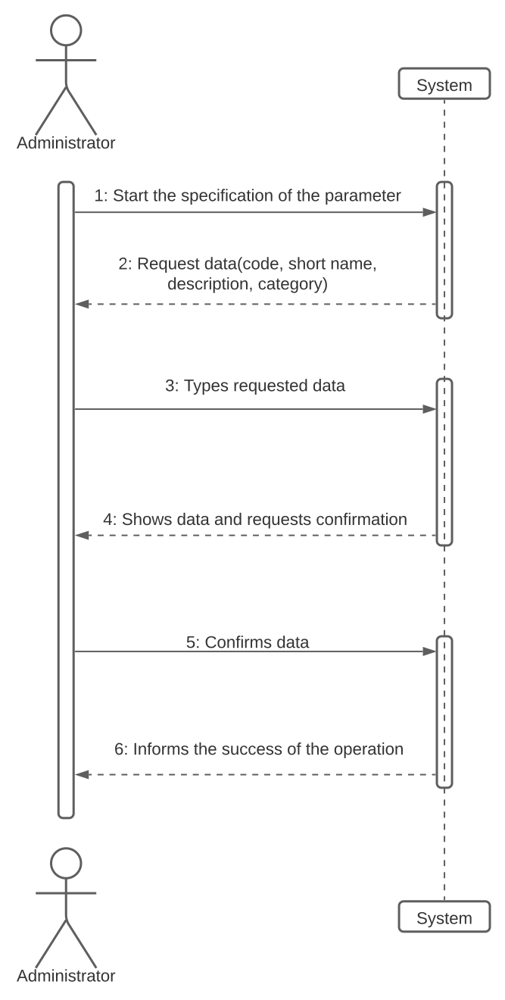
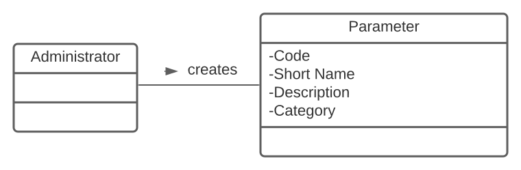
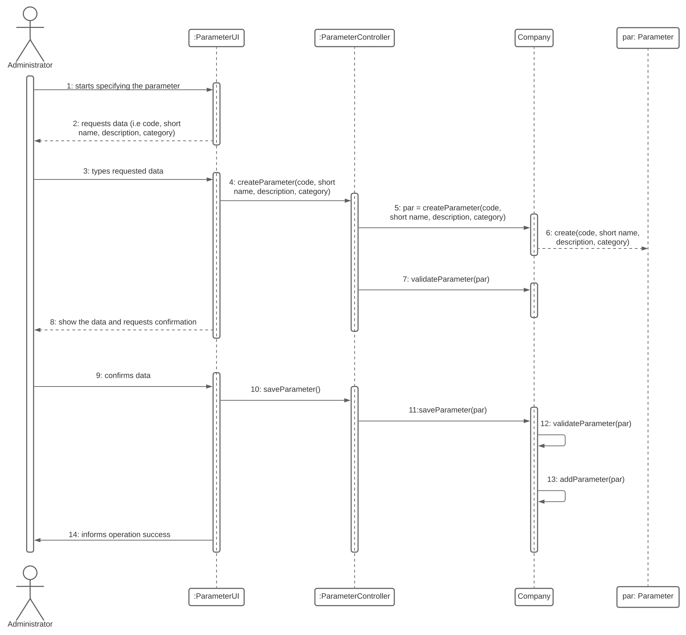
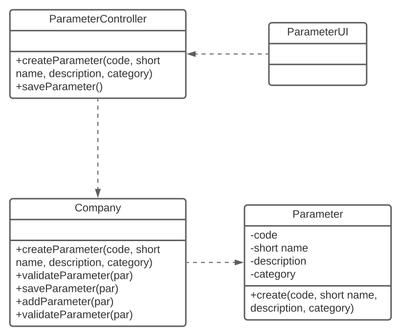

# US 010 - New Parameter

## 1. Requirements Engineering

Specify a new parameter with a Code, a Short Name, a Description and a Category, the Code with 5 alphanumeric characters, the Short Name with less than 8 characters and the Description with less than 20 characters. The input are these requirements and the output is a success/error message saying if the parameter was created and categorizesor not.

### 1.1. User Story Description

As an administrator, I want to specify a new parameter and categorize it.

### 1.2. Customer Specifications and Clarifications 

The information provided by the administrator should be a Code, a Short Name, a Description and a Category.

### 1.3. Acceptance Criteria

The Code should be 5 alphanumeric numbers, the Short Name up to 8 characters and the Description a String with no more than 20 characters.

### 1.4. Found out Dependencies

It uses the parameter categories specified in US11 to select the category from a list of categories created there.

### 1.5 Input and Output Data

**Input Data:**

 * Typed Data:
	* Code
	* Short Name
    * Description
	
* Selected data:
	* (none)

**Output Data:**

 * Success/Error message

### 1.6. System Sequence Diagram (SSD)

### 1.7 Other Relevant Remarks

**i)**
 - The number of alphanumeric numbers and characters in the Code, Short Name and Description

**ii)**
 - There are no data/technology variations
 
**iii)**
 - The US should be used as long as needed

## 2. OO Analysis

### 2.1. Relevant Domain Model Excerpt 

### 2.2. Other Remarks

There are no other remarks 

## 3. Design - User Story Realization 

### 3.1. Rationale

**The rationale grounds on the SSD interactions and the identified input/output data.**

| Interaction ID | Question: Which class is responsible for... | Answer  | Justification (with patterns)  |
|:-------------  |:--------------------- |:------------|:---------------------------- |
| Step 1|...interacting with the administrator?|ParameterUI|This is the class responsible for getting/giving information from/to the person using|
||...coordinating the US|ParameterController?|Controlling the US|
||...register the parameter and it's category?|Company|The Company manages the parameters|
| Step 2||||
| Step 3|...validating the data given?|Administrator|He knows if the data is correctly typed|
| Step 4||||
| Step 5|...validating all data?|Company|Determines if the data is valid|
||...saving the data?|Company|Saves the parameter and the parameters|
| Step 6|...informing the succss of the operation?|ParameterUI|The class responsible for the interaction with the administrator|

### Systematization ##

According to the taken rationale, the conceptual classes promoted to software classes are: 

 * Company

Other software classes (i.e. Pure Fabrication) identified: 

 * ParameterUI  
 * ParameterController

## 3.2. Sequence Diagram (SD) 

## 3.3. Class Diagram (CD)

# 4. Tests 

**Test 1:** Check that it is not possible to create a code with numbers
 
	@Test
    public void validateCode1() {
        int realValue = Parameter.validateCode("12345");
        int expectedValue = 1;
        assertEquals(expectedValue, realValue);
    }
 
**Test 2:** Check that it is not possible to create a name with more than 8 characters
 
	@Test
    public void validateName1() {
        int realValue = Parameter.validateName("Red Blood Cells");
        int expectedValue = 2;
        assertEquals(expectedValue, realValue);
    }
 
**Test 3:** Check that it is not possible to create a description with more than 20 characters

	@Test
    public void validateDescription1() {
        int realValue = Parameter.validateDescription("Red Blood Cellsssssssss");
        int expectedValue = 3;
        assertEquals(expectedValue, realValue);
    }
 
# 5. Construction (Implementation)
 
The design created was not followed interelly because of some changes that were made for it to become simpler and for the code to be easier to follow. Also, changes were made according to the client's specifications. 
 
# 6. Integration and Demo 
 
It was not hard to implement with the other classes as the design implemented was pretty straight forward and easy to use.
 
# 7. Observations
 
I believe the final code for this US was preety good as it seems pretty organized and easy to follow as an outsider.
 
 