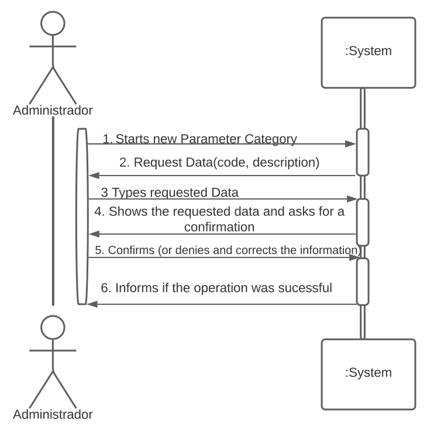
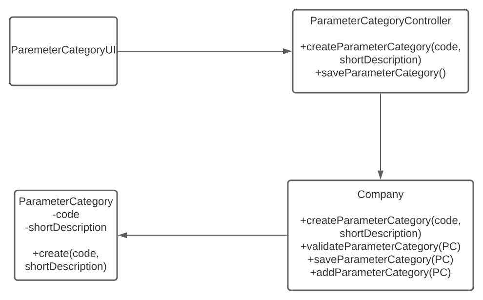
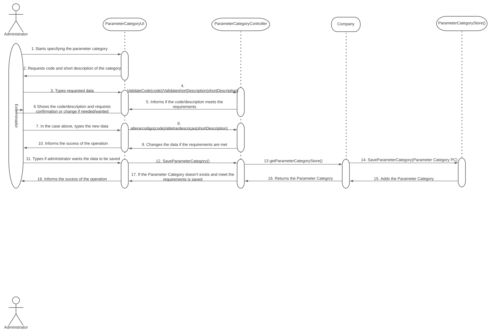

# US 011 - New Category

## 1. Requirements Engineering

Specify a new category with a Code and a Description of the category.

### 1.1. User Story Description

As an administrator, I want to specify a new parameter and category.

### 1.2. Customer Specifications and Clarifications

"Each category has a name and a unique code. There are no subcategories."

### 1.3. Acceptance Criteria

The code should have 5 alphanumeric characters.
The description should have 10 letters.

### 1.4. Found out Dependencies

It uses the parameter created in US10 so that in this US, the administrator can create a new category.

### 1.5 Input and Output Data

**Input Data:**

* Typed Data:
	* Code
	* Description

* Selected data:
	* ParameterCategory
	
**Output Data:**
informs if the creation was successful.

### 1.6. System Sequence Diagram (SSD)

### 1.7 Other Relevant Remarks
<<<<<<< HEAD

Use this section to capture other relevant information that is related with this US such as (i) special requirements ; (ii) data and/or technology variations; (iii) how often this US is held.
=======
>>>>>>> 72bdf1b4013093b9f17e828b7084c4dea29c27f3

There are no other relevant remarks.
## 2. OO Analysis

### 2.1. Relevant Domain Model Excerpt

### 2.2. Other Remarks

There are no other remarks

## 3. Design - User Story Realization

### 3.1. Rationale

|Interaction ID	| Question: Which class is responsible for... | Answer | Justification (with patterns) |
<<<<<<< HEAD
|Interaction ID    | Question: Which class is responsible for... | Answer | Justification (with patterns) |
|:-------------  |:--------------------- |:------------|:---------------------------- |
|Step 1    |Interating with the administrator    |ParameterCategoryUI    |    It is the class that asks questions to the administrator and the one receiving information from all the others, so it only makes sense that is the one interacting with the administrator|
        |Coordinating the US |ParameterCategoryController| It is the class with the most important methods|
        |Registering a new Parameter Category| Company|
|Step 2    |    |    |    |
|Step 3    |validating the data locally(this is, if the code has 5 digits for example)    |ParameterCategoryController    |It is the method that validates the data and asks for more, if the first is invalid|    |
|Step 4    |    |    |    |
|Step 5    |validating the data globally and saving the Parameter Category(this is, if the data already exists for example)    |ParameterCategoryStore    |It is the method that validates the data, in a global perspective and the store class is the most suited for that job    |
|Step 6    |informing the sucess of the operation |ParameterCategoryUI    |    It is the class that communicates with the administrator so its the most suited to send a message if the operation was successful|
=======
|:-------------  |:--------------------- |:------------|:---------------------------- |
|Step 1	|	|	|	|
|Step 2	|	|	|	|
|Step 3	|	|	|	|
|Step 4	|	|	|	|
|Step 5	|	|	|	|
|Step 6	|	|	|	|
>>>>>>> 72bdf1b4013093b9f17e828b7084c4dea29c27f3
		
### Systematization ##

According to the taken rationale, the conceptual classes promoted to software classes are:

 * Company
 * Parameter Category

Other software classes (i.e. Pure Fabrication) identified: 
 
 * ParameterCategoryUI
 * ParameterCategoryController

## 3.2. Sequence Diagram (SD)

## 3.3. Class Diagram (CD)

# 4. Tests
Obs: The tests are only refering to methods that don't include any inputs in the code of those methods, for example the method alterarcodigo(code), in the class ParameterController.
ParameterCategoryControllerTest:
import static org.junit.jupiter.api.Assertions.*;

class ParameterCategoryControllerTest {
    ParameterCategoryController testezinhos=new ParameterCategoryController();

    @org.junit.jupiter.api.Test
    void validatecodeteste1() {
        String code="r1mms";
        int expresult=0;
        int result=testezinhos.validatecode(code);
        assertEquals(expresult,result,0.0);
    }
    @org.junit.jupiter.api.Test
    void validatecodeteste2() {
        String code="r1ms";
        int expresult=1;
        int result=testezinhos.validatecode(code);
        assertEquals(expresult,result,0.0);
    }

    @org.junit.jupiter.api.Test
    void validateshortDescription1() {
        String shortDescription="qwert1uiop";
        int expresult=1;
        int result=testezinhos.validateshortDescription(shortDescription);
        assertEquals(expresult,result,0);
    }
    @org.junit.jupiter.api.Test
    void validateshortDescription2() {
        String shortDescription="qweryuiop";
        int expresult=1;
        int result=testezinhos.validateshortDescription(shortDescription);
        assertEquals(expresult,result,0);
    }
    @org.junit.jupiter.api.Test
    void validateshortDescription3() {
        String shortDescription="qwerty0iop";
        int expresult=1;
        int result=testezinhos.validateshortDescription(shortDescription);
        assertEquals(expresult,result,0);
    }

    @org.junit.jupiter.api.Test
    void saveParameterCategory() {
        boolean expresult=true;
        boolean result=testezinhos.SaveParameterCategory();
        assertEquals(expresult,result);
    }
}

ParameterCategoryStoreTest:
import org.junit.jupiter.api.Test;

import static org.junit.jupiter.api.Assertions.*;

class ParameterCategoryStoreTest {
    ParameterCategoryStore testes2= new ParameterCategoryStore();
    ParameterCategory PCtrue=new ParameterCategory("rocky","Kingstonzz");
    ParameterCategory PCfalse=new ParameterCategory("rocky","Kingstonzz");
    @org.junit.jupiter.api.Test
    void validateParameterCategory1() {

        boolean expresult = true;
        boolean result =testes2.ValidateParameterCategory(PCtrue);
        assertEquals(expresult,result);
    }

    @Test
    void saveParameterCategory1() {
        boolean expresult=true;
        boolean result= testes2.SaveParameterCategory(PCtrue);
        assertEquals(expresult,result);
    }

    @Test
    void validateParameterCategory2() {
        boolean expresult = false;
        testes2.SaveParameterCategory(PCfalse);
        boolean result =testes2.ValidateParameterCategory(PCfalse);
        assertEquals(expresult,result);
    }
    @Test
    void saveParameterCategory2() {
        boolean expresult=false;
        testes2.SaveParameterCategory(PCfalse);
        boolean result= testes2.SaveParameterCategory(PCfalse);
        assertEquals(expresult,result);
    }

}

# 5. Construction (Implementation)
ParameterCategoryController:

package app.controller;
import app.domain.model.Company;
import app.domain.model.Parameter;
import app.domain.model.ParameterCategory;

import java.util.Scanner;

public class ParameterCategoryController {
    static Scanner ler = new Scanner(System.in);
    ParameterCategory Teste3;
    int flag1 = 0;

    public int validatecode(String code) {
        char[] verifyAlphanumerics = code.toCharArray();
        boolean containsNumbers = false;
        for (char verifyAlphanumeric : verifyAlphanumerics) {
            if (Character.isDigit(verifyAlphanumeric)) {
                containsNumbers = true;
            }
        }
        boolean seeIfExists = false;
        for (int i = 0; i < Company.getCodeList().size(); i++) {
            if (code.equals(Company.getCodeList().get(i))) {
                seeIfExists = true;
                break;
            }
        }
        if (code.length() != 5 || containsNumbers || seeIfExists) {
            return 1;
        }else {
            return 0;
        }
    }

    public int validateshortDescription(String shortDescription) {
        if (shortDescription.length() > 10) {
            return 1;
        } else return 0;
    }

    public String alterarcodigo(String code) {
        String newcode;
        String resposta3;
        newcode = ler.nextLine();
        if (newcode.equals(code)) {
            System.out.println("WATCH OUT! Before moving on to the next step mind that the new code you just introduced and the first are the same!");
        }
        System.out.println("You're about to change your code from " + code + " to " + newcode + ". Would you like to continue?(y/n)");
        resposta3 = ler.nextLine();
        do {
            if (resposta3.equalsIgnoreCase("n")) {
                System.out.println("The new code wasn't saved, therefore, the one about to be saved is going to be the first you introduced.");
                return code;
            }
            if (resposta3.equalsIgnoreCase("y")) {
                System.out.println("Your new code is " + newcode);
                return newcode;
            } else {
                System.out.println("Please enter a valid answer. (Y/N)");
                resposta3 = ler.nextLine();
            }
        } while (!resposta3.equalsIgnoreCase("n") || !resposta3.equalsIgnoreCase("y"));
        return "Se esta mensagem aparecer, o método alterarcódigo tem um erro.";
    }

    public String alterardescriçao(String shortDescription) {
        String newshortDescription;
        String resposta;
        newshortDescription = ler.nextLine();
        if (newshortDescription.equals(shortDescription)) {
            System.out.println("WATCH OUT! Before moving on to the next step mind that the new category description you just introduced and the first are exactly the same!");
        }
        System.out.println("You are about to change the description from " + shortDescription + " to " + newshortDescription + ". Would you like to continue? (Y/N)");
        resposta = ler.nextLine();
        do {
            if (resposta.equalsIgnoreCase("y")) {
                System.out.println("Your description is now " + newshortDescription);
                flag1 = 1;
                return newshortDescription;

            }
            if (resposta.equalsIgnoreCase("n")) {
                System.out.println("The new description wasn't saved.");
                return shortDescription;
            }
        } while (!resposta.equalsIgnoreCase("y") && !resposta.equalsIgnoreCase("n"));

        return "Se esta mensagem aparecer, o método alterardescrição tem um erro";
    }

    public boolean SaveParameterCategory(ParameterCategory PC) {
        return Company.getParameterCategoryStore().SaveParameterCategory(PC);
    }

    public ParameterCategory createParameterCategory(String code, String description){
        this.Teste3 = new ParameterCategory(code,description);
        return Teste3;
    }

    public static void addParameter(Parameter parameter, int categoryNumber){
        Company.getParametercategorylist().get(categoryNumber).addParameter(parameter);
    }
}
ParameterCategoryStore:
package app.domain.store;

import app.domain.model.Company;
import app.domain.model.ParameterCategory;

public class ParameterCategoryStore {
    private String code;
    //private static final String DEFAULTCODE = "Default Code";
    //private static final String DEFAULTDESCRIPTION = "Default Description";
    private String shortDescription;

    public String getCode() {
        return code;
    }

    public void setCode(String code) {
        this.code = code;
    }

    public String getShortDescription() {
        return shortDescription;
    }

    @Override
    public String toString() {
    return "Company{" +
                "code='" + code + '\'' +
                ", shortDescription='" + shortDescription + '\'' +
                '}';
    }

    public ParameterCategoryStore() {
        /**
         * We dont need any parameter
         */
    }

    public boolean SaveParameterCategory(ParameterCategory PC) {
        ValidateParameterCategory(PC);
        return Company.getParametercategorylist().add(PC);

    }

    public boolean ValidateParameterCategory(ParameterCategory PC) {
        if (PC == null) {
            return false;
        }
        if (Company.getParametercategorylist().contains(PC)) {
            return false;

        } else return true;
    }
}
# 6. Integration and Demo
In this US, the interface was made in a way that could protect the user from making mistakes, so there was options to change the description and the code, as well as keeping the user updates with custom messages which stated if the description or the code of the description category was valid, invalid but most important of all, if it was saved successfully or not. 

# 7. Observations
Taking into consideration the point 6. above, we think that the code is complete, and provides enough features for the administrator to register with success the information needed