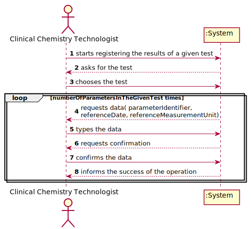

# US 012 - Record the results of a given test

## 1. Requirements Engineering

The clinical chemistry technologist starts by registering the results. The system asks for
the kind of test to insert the results. He chooses the given test. The system requests the 
needed data. The clinical chemistry technologist types the data. The system informs the
(in)success of the operation.
 

### 1.1. User Story Description

As a clinical chemistry technologist, I intend to record the results of a given test.

### 1.2. Customer Specifications and Clarifications 

**From the client clarifications:**

> **Question:** 
>  
> **Answer:** 

-

> **Question:** 
>  
> **Answer:** 

### 1.3. Acceptance Criteria

* AC1:  The application should use an external module that is responsible
	for providing the test reference values. The application can use an external module for
	each type of test. For instance, when the results are for blood tests parameters, the
	externalmodule BloodReferenceValues1API can be used. When the results are for
	Covid-19 tests parameters, the external module CovidReferenceValues1API can be used.
	In any case, the API request should include, at most: (i) a key to access the module (e.g.: 
	“KEY1234”); (ii) a parameter identifier; (iii) the reference date; and (iv) reference
	measurement unit (e.g. "mg").

### 1.4. Found out Dependencies

This US depends from the US04 (and the US05 & US010 [?])

### 1.5 Input and Output Data

**Input Data:**

* Typed data:
	* keyToAccessModule (e.g. "KEY1234" )
	* parameterIdentifier
	* referenceDate
	* referenceMeasurementUnit (e.g. "mg" )
	
* Selected data:
	* givenTest

**Output Data:**

   * (In)Success of the operation

### 1.6. System Sequence Diagram (SSD)

### 1.7 Other Relevant Remarks

* This US is done in a loop for every parameter of a given test.

## 2. OO Analysis

### 2.1. Relevant Domain Model Excerpt 

### 2.2. Other Remarks

n/a

## 3. Design - User Story Realization 

### 3.1. Rationale

**The rationale grounds on the SSD interactions and the identified input/output data.**

| Interaction ID | Question: Which class is responsible for... | Answer  | Justification (with patterns)  |
|:-------------  |:--------------------- |:------------|:---------------------------- |
| Step 1  		 |	...interacting with the actor? | ClientUI  |   There is no reason to assign this to any other class. |
|				 |  ...coordinating the US? | ClientController | Controller |
|                |  ...registering a new client? | Company | 
| Step 2  		 |							 |             |                              |
| Step 3  		 |	... validating all data (local validation)? | Client | Owns its data.
| Step 4  		 |							 |             |                              |
| Step 5   		 |	... validating all data (global validation)? | Company | Knows all clients | 
| 			 |	... saving the client? | Company | The client was registered in the Company | 
| Step 6  		 |	... informing operation success?| ClientUI  | Responsible for user interactions.  |       

### Systematization ##

According to the taken rationale, the conceptual classes promoted to software classes are: 

 * Company
 * Client

Other software classes (i.e. Pure Fabrication) identified: 

 * ClientUI  
 * ClientController

## 3.2. Sequence Diagram (SD)

## 3.3. Class Diagram (CD)

# 4. Tests 
*In this section, it is suggested to systematize how the tests were designed to allow a correct measurement of requirements fulfilling.* 

**_DO NOT COPY ALL DEVELOPED TESTS HERE_**

# 5. Construction (Implementation)

# 6. Integration and Demo 

# 7. Observations

