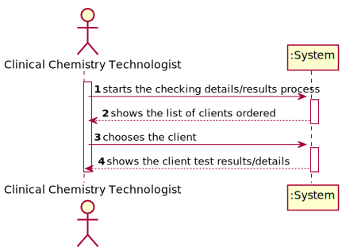
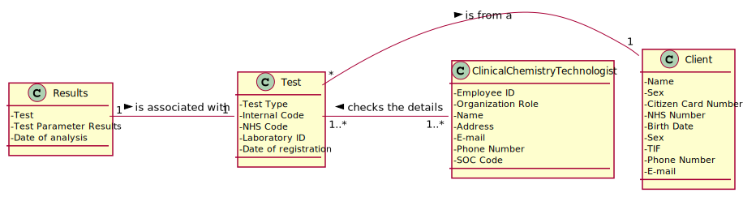
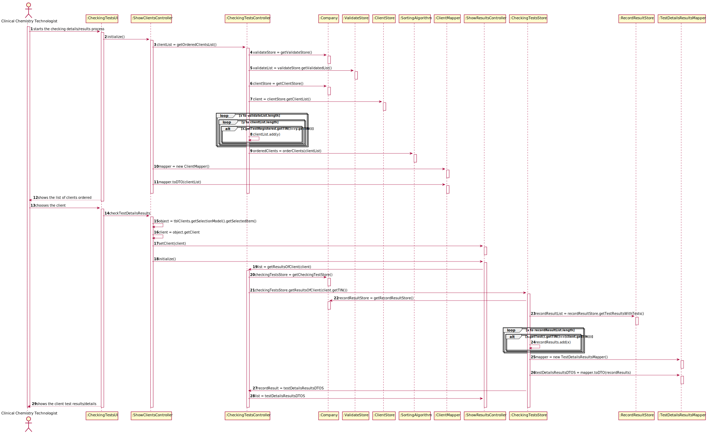
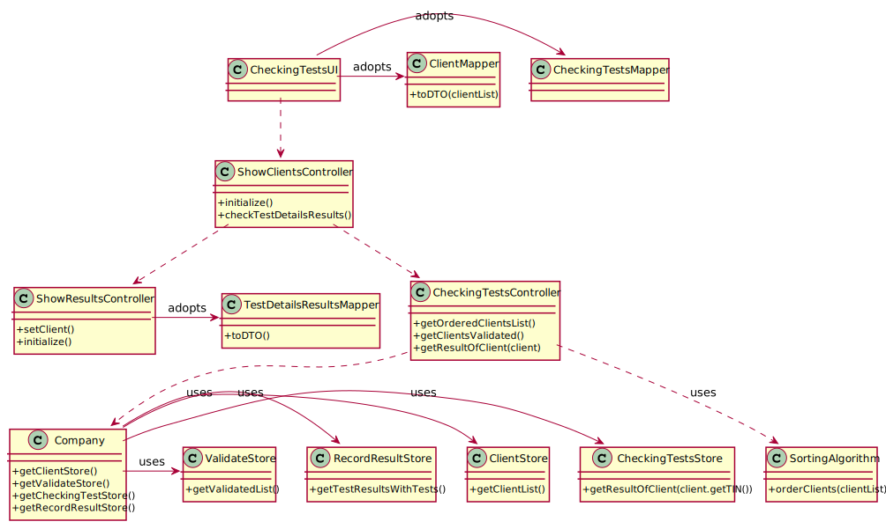

# US013 - Consult historical tests, made by a client, and check his test details/results

## 1. Requirements Engineering

The clinical chemistry technologist starts the checking results process. He gets the list ordered by TIF or Name depending on the execution time of them. Chooses the client he wants to check. Sees the results/details of the tests this client has done in the past.

### 1.1. User Story Description

As a clinical chemistry technologist, I intend to consult the historical tests
performed by a particular client and to be able to check tests details/results.

### 1.2. Customer Specifications and Clarifications

>**Question:** Should we show every client already registered when we show the clients' list to the clinical chemistry technologist or should we only show the clients' with a test or more already assigned?
>
>**Answer:** The system should show only clients that have tests already validated by the lab coordinator.

-

>**Question:** Should the user be the one selecting if the Clients are ordered by Name or TIN, or should it be defined through the configuration file? If it is the user, how should he be able to select it?
>
>**Answer:** When using the application, the clinical chemistry technologist should be able to sort the clients by name or TIN.
The algorithm that will be used to sort the data should be defined through a configuration file.

-

>**Question:** In the User Story 13, the Clinical Chemistry Technologist to "choose the target client" needs to type the name (or TIN number)? Or should be a list present with all the client's available and, after that, be possible to select one?
>
>**Answer:** From the requirements introduced in the beginning of Sprint D: "The application must allow ordering the clients by TIN and by name to help the clinical chemistry technologist choose the target client". A sorted list should be presented to the clinical chemistry technologist.

-

>**Question:** In US13, the Clinical Chemistry Technologist, can select more than one client at once to view its historical test results?
>
>**Answer:** No.

-

>**Question:** Moreover, will all the tests associated with the client be displayed or the clinical chemistry technologist will have also to select the tests he wants to see?
>
>**Answer:** After selecting one client, the application should show all the historical test results, of that client, to the Clinical Chemistry Technologist.

-

>**Question:** From the user story description "As a clinical chemistry technologist, I intend to consult the historical tests performed by a particular client and to be able to check tests details/results". What do you mean by "check tests details/results" ?
>
>**Answer:** The clinical chemistry technologist should be able to check the historical tests performed by a particular client and see the results obtained in each test. For a given client (that was selected by the clinical chemistry technologist) the application should show all tests performed by the client and, for each parameter, the application should show the parameter value and the parameter reference values. The clinical chemistry technologist should not have access to the report made by the specialist doctor.
### 1.3. Acceptance Criteria

The application must allow ordering the clients by TIN and
by name to help the clinical chemistry technologist choose the target client.

The ordering algorithm to be used by the application must be defined through a
configuration file. At least two sorting algorithms should be available.

The sorting algorithm must be chosen to depend mainly on their execution time.
### 1.4. Found out Dependencies

This US depends on the US 3 for the clients, US 4 for the registered tests, US 12 for the results for the tests, and US15 to get the validated tests.

### 1.5 Input and Output Data

**Input Data:**

* Typed data:
    * (none)
* Selected data:
    * Client

**Output Data:**

* (In)Success of the operation
* The details/results of the test of a client

### 1.6. System Sequence Diagram (SSD)

### 1.7 Other Relevant Remarks

n/a

## 2. OO Analysis

### 2.1. Relevant Domain Model Excerpt

In this section, it is suggested to present an excerpt of the domain model that is seen as relevant to fulfill this requirement.

### 2.2. Other Remarks

n/a

## 3. Design - User Story Realization

### 3.1. Rationale

**The rationale grounds on the SSD interactions, and the identified input/output data.**

| Interaction ID | Question: Which class is responsible for... | Answer  | Justification (with patterns)  |
|:-------------  |:--------------------- |:------------|:---------------------------- |
| Step 1  		 |	...interacting with the actor? | CheckingTestsUI  |   There is no reason to assign this to any other class. |
|				 |  ...coordinating the US? | ShowClientsController | Controller |
|                |  ...order the clients? | CheckingTestsController | This is the class responsible for ordering the client list |
| Step 2  		                 |  ... show the client? | CheckingTestsUI | It's responsible for showing the client list to the actor |	
| Step 3  		 |	... getting the tests of the client chosen? | CheckingTestsStore | Interrelated with the company, making it easier for it to access the location of the other objects needed |
|
| Step 4  		 |	... show the client test results/details? | CheckingTestsUI  | Responsible for user interactions.  |   
|                |  ... get the test results/details to be shown? | CheckingTestsMapper | Responsible to show the UI the domain |

Systematization
According to the taken rationale, the conceptual classes promoted to software classes are:

* OrderClients

Other software classes (i.e. Pure Fabrication) identified:
* CheckingTestsController
* CheckingTestsStore
* CheckingTestsMapper
* CheckingTestsUI

### 3.2. Sequence Diagram (SD)

### 3.3. Class Diagram (CD)

## 4. Tests
In this section, it is suggested to systematize how the tests were designed to allow a correct measurement of requirements fulfilling.

DO NOT COPY ALL DEVELOPED TESTS HERE

Test 1: Check that it is not possible to create an instance of the Example class with null values.

@Test(expected = IllegalArgumentException.class)
    public void ensureNullIsNotAllowed() {
    Exemplo instance = new Exemplo(null, null);
}
It is also recommended to organize this content by subsections.

## 5. Construction (Implementation)
In this section, it is suggested to provide, if necessary, some evidence that the construction/implementation is in accordance with the previously carried out design. Furthermore, it is recommeded to mention/describe the existence of other relevant (e.g. configuration) files and highlight relevant commits.

It is also recommended to organize this content by subsections.

## 6. Integration and Demo
In this section, it is suggested to describe the efforts made to integrate this functionality with the other features of the system.

## 7. Observations
In this section, it is suggested to present a critical perspective on the developed work, pointing, for example, to other alternatives and or future related work.