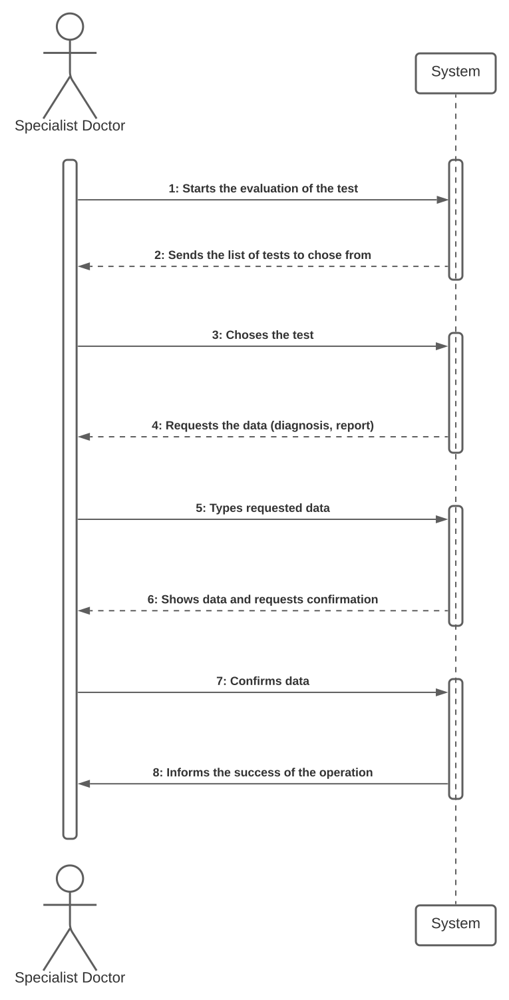
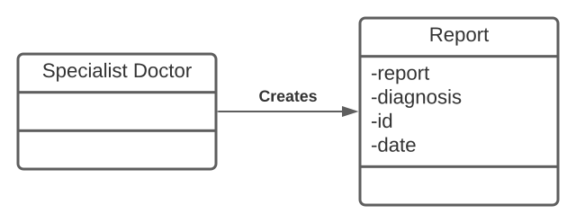
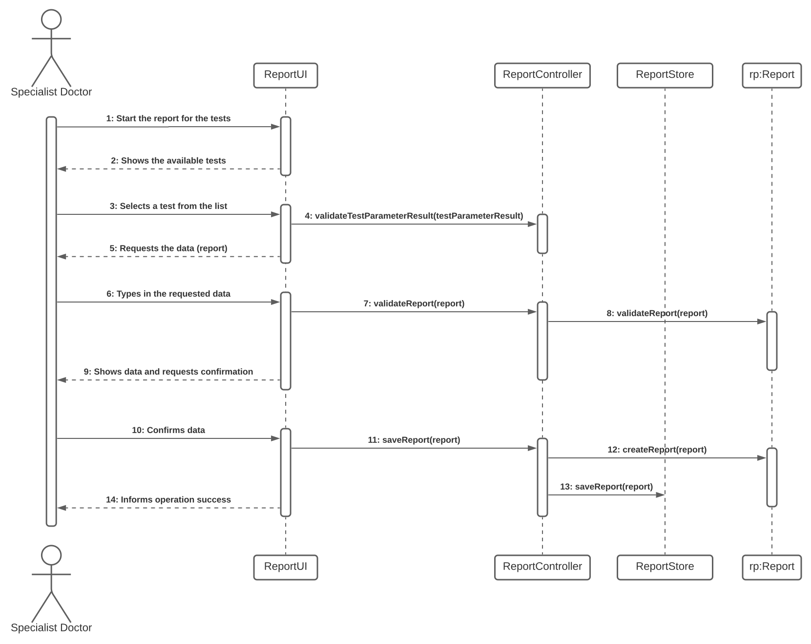
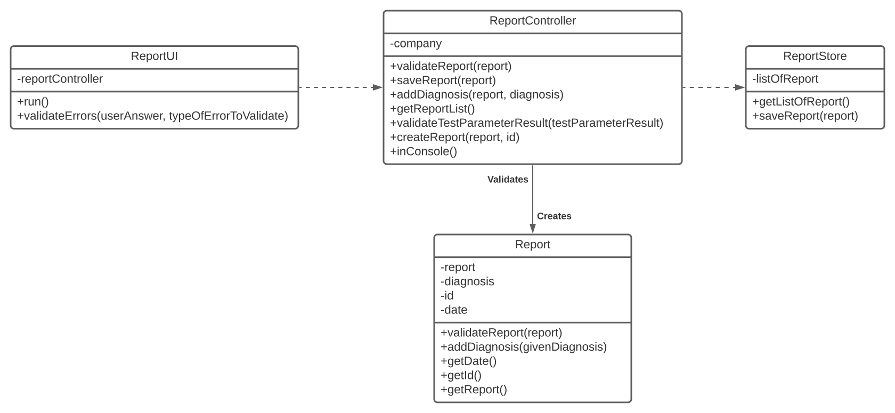

# US 014 - Writing Reports

## 1. Requirements Engineering

In this US the specialist doctor makes the diagnosis and writes a report for a given test. Here, the specialist doctor is given a test list to choose a test from which writes a report on. The test's information is given to the specialist doctor, the diagnosis is made according to the test's information and then the doctor writes a report on it.

### 1.1. User Story Description

"As a specialist doctor, I intend to make the diagnosis and write a report for a given test."

### 1.2. Customer Specifications and Clarifications 

- : The systems should show all tests ready, the specialist doctor selects one and then writes a report for the selected test.
- : The report and the diagnosis has, at most 400 words.
- : The report contains the diagnosis and the report is free text.

### 1.3. Acceptance Criteria

- : The report and the diagnosis has, at most 400 words.

### 1.4. Found out Dependencies

This US requires the test made in the US09.

### 1.5 Input and Output Data

The test is chosen by the specialist doctor, the diagnosis is made and he writes the report on it, after that, the information is displayed and then, if the specialist doctor approves, the information is saved. 

### 1.6. System Sequence Diagram (SSD)

### 1.7 Other Relevant Remarks

There are no special requirementes nor data or technology variations. Also, this US can be held an unacountale amount of times.

## 2. OO Analysis

### 2.1. Relevant Domain Model Excerpt 

### 2.2. Other Remarks

This should all work only as a specialist doctor.

## 3. Design - User Story Realization 

### 3.1. Rationale

**The rationale grounds on the SSD interactions and the identified input/output data.**

| Interaction ID | Question: Which class is responsible for... | Answer  | Justification (with patterns)  |
|:-------------  |:--------------------- |:------------|:---------------------------- |
|Step 1|... showing the user the tests available?|ReportUI|This class is responsible for communicating with the user|
|Step 2|... recieveing the user's input?|ReportUI|This class is also reponsible for getting the user's inputs|
|Step 3|... handling the information that is given by the user?|ReportController|It's the controller's job to handle the information given by the UI|
|Step 4|...	storing the reports made?|ReportStore|The function of the Store class is to store the reports made by the specialist doctors|
|Step 5|... getting the information from the Store and giving it to the Controller?|Company|The Company serves as an intermediary to get to the store|
|Step 6|.. showing a success or error message in completing the wanted task?|ReportUI|The function of the class is to communicate back to the user an error or success message|              

### Systematization ##

According to the taken rationale, the conceptual classes promoted to software classes are: 
 * Company

Other software classes (i.e. Pure Fabrication) identified: 
 * ReportUI  
 * ReportController
 * ReportStore 

## 3.2. Sequence Diagram (SD)

## 3.3. Class Diagram (CD)

# 4. Tests 

**Test 1:** Validate the user's answer to chosing an option, from a list of options, it returns false as there are no problems with the answer from the user. 

	@Test
    public void validateErrors7() {
        ReportUI reportUI = new ReportUI();
        boolean realValue = reportUI.validateErrors("1", 3);
        assertFalse(realValue);
    }
	
**Test 2:** Checks if the report made by the user has less than 400 words, it returns true because it does have less than 400 words. 

	@Test
    public void validateReport() {
        boolean realValue = Report.validateReport("This report has less than 400 words");
        assertTrue(realValue);
    }
	
**Test 3:** This one saves a Report, it is more extense because it has to create some objects to simulate the saving of the Report in the chosen test. 

	@Test
    public void saveReport() {
        ReportController reportController = new ReportController();
        List<TestParameterResult> testParameterResultList = new ArrayList<>();
        List<Parameter> parameterList = new ArrayList<>();
        String ccn = "1234567812345678";
        parameterList.add(new Parameter("BLOOD","blood","blood"));
        RegisterTest test2 = new RegisterTest(parameterList,Long.parseLong(ccn),new TypeOfTest("blood","blood","blood"),"123456789121","123456789121");
        RecordResult recordResult = new RecordResult(test2,testParameterResultList);
        RecordResultStore.getTestResultsWithTests().add(recordResult);
        boolean realValue = reportController.saveReport(new Report("Just a casual report to save",0));
        assertTrue(realValue);
    }
	

# 5. Construction (Implementation)

The implementation of the created desing went well but some changes had to be made according to some of the client's specifications.

**Part 1:** This is a piece of code from the store, it validates the position of the report and adds a report to the list of existing reports.

    public boolean saveReport(Report report) {
        ValidateController.addPositionToInsertReport(report);
        return listOfReport.add(report);
    }
    
**Part 2:** This part validates the report and checks if it has less than the maximum of words allowed.

    public static boolean validateReport(String report){
        String[] wordList = report.split(" ");
        return wordList.length <= NUMEROPALAVRAS;
    }
    
**Part 3:** Here the validation of the TestParameterResult is made.

    public String validateTestParameterResult(TestParameterResult testParameterResult) {
        return ValidateTestParameterResult.validateTestParameterResult(testParameterResult);
    }
    
**Part 4:** The given error is validated according to the number given to identify the type of validation to be made.

    public boolean validateErrors(String userAnswer, int typeOfErrorToValidate){
        if (typeOfErrorToValidate == 1) {
            try {
                Integer.parseInt(userAnswer);
            } catch (NumberFormatException e) {
                ReportController.inConsole("Invalid answer, try a number");
                return true;
            }
            if (Integer.parseInt(userAnswer) > RecordResultStore.getTestResultsWithTests().size() || Integer.parseInt(userAnswer) < 0) {
                ReportController.inConsole("Invalid answer, try a number from the list");
                return true;
            }
            return false;
        }
        
        
The connection with other US also went well as both the other US and this one were simple to use. 

# 6. Integration and Demo 

Simple to integrate with the other US as it did not require much information other than the created objects.

# 7. Observations

This US was easy to create, I do not see any other way to make this as this seems to be the simplest and best way to do this US.

