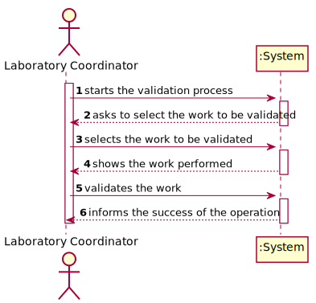
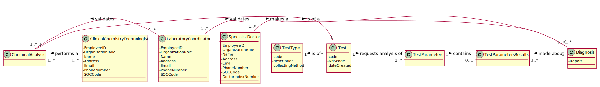
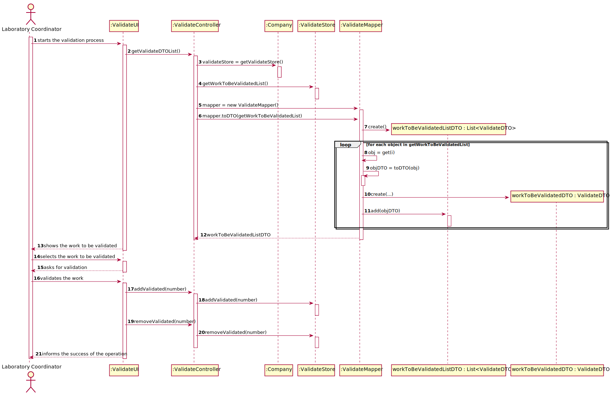
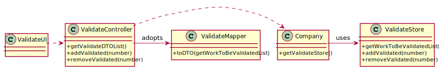

# US 015 - Validates the work done by the Clinical Chemistry Technologist and Specialist Doctor

## 1. Requirements Engineering

The laboratory coordinator starts the validation proccess. Selects the work done by Clinical Chemistry Technologist
and Specialist Doctor. The system shows the work done. The laboratory coordinator validates the work performed. The sytems
informs the (in)success of the validation. 
 

### 1.1. User Story Description

As a laboratory coordinator, I want to validate the work done by the clinical chemistry technologist and specialist doctor. 

### 1.2. Customer Specifications and Clarifications 

**From the client clarifications:**

> **Question:** Should the laboratory coordinator validate the test results one by one or should he do only one validation of all of them?
>  
> **Answer:** The coordinator can validate all or a subset of test results. The system does not show client personal information but shows all dates (test registration date, chemical analysys date and diagnosis date). 

-

> **Question:** Regarding the process of validating a certain test/result, what validation states should be considered by the laboratory coordinator?
For example, can "Valid" or "Invalid" be accepted as a confirmation for the chemical test/result and its diagnosis?
>  
> **Answer:** Only Valid state. The system shows all tests ready to validate (tests that already have the test registration date, the chemical analysys date and the diagnosis date registered in the system) and the laboratory coordinator selects one or more tests to mark as validated.

-

> **Question:** When the laboratory coordinator wants to validate a test does all the tests available show up for him or does he search using a code that identifies a specific test?
>
> **Answer:** The system shows all tests ready to validate (tests that already have the test registration date, the chemical analysys date and the diagnosis date registered in the system) and the laboratory coordinator selects one or more tests to mark as validated. 

-

> **Question:** After validation do we need to have the time and date of the validation?
>
> **Answer:** Yes, the system should record the date (DD/MM/YYYY) and time (HH:MM) when the validation was made. 
	      Moreover, in this US, when the system shows to the laboratory coordinator all the dates (test registration date, chemical analysis date and diagnosis date), the system should show the date (DD/MM/YYYY) and the time (HH:MM).

-

> **Question:** What's the Criteria to the validation of the test? We only receive dates but what do we have to do to check if everything is "ok" to validate?
>
> **Answer:** The lab coordinator only checks the dates (date and time) and validates a subset of tests that he selects. The lab coordinador does not check any other information. 

-

> **Question:** Regarding the process of validating a certain test/result, what validation states should be considered by the laboratory coordinator?
		For example, can "Valid" or "Invalid" be accepted as a confirmation for the chemical test/result and its diagnosis?
>
> **Answer:** Only Valid state. The system shows all tests ready to validate (tests that already have the test registration date, the chemical analysys date and the diagnosis date registered in the system) and the laboratory coordinator selects one or more tests to mark as validated.

### 1.3. Acceptance Criteria

* AC1:  The system does not show client personal information but
		shows all dates (test registration date, chemical analysis date and diagnosis date).
* AC2:  The system should record the validation date in the format (DD/MM/YYYY) and time (HH:MM)
* AC3:  The system shows all tests ready to validate, and marks them as validated

### 1.4. Found out Dependencies

This US depends on the US12 and US14

### 1.5 Input and Output Data

**Input Data:**

* Typed data:
	* validation
	
* Selected data:
	* workToBeValidated

**Output Data:**

   * (In)Success of the operation

### 1.6. System Sequence Diagram (SSD)

### 1.7 Other Relevant Remarks

* It should validate all the work done, not only the dates

## 2. OO Analysis

### 2.1. Relevant Domain Model Excerpt 

### 2.2. Other Remarks

n/a

## 3. Design - User Story Realization 

### 3.1. Rationale

**The rationale grounds on the SSD interactions and the identified input/output data.**

| Interaction ID | Question: Which class is responsible for... | Answer  | Justification (with patterns)  |
|:-------------  |:--------------------- |:------------|:---------------------------- |
| Step 1  		 |	...interacting with the actor? | ValidateUI  |   There is no reason to assign this to any other class. |
|				 |  ...coordinating the US? | ValidateController | Controller |
|                |  ...validates the work performed? | ValidateStore | It's connected to the Company having the information to be validated. |
| Step 2  		 |							 |             |                              |
| Step 3  		 |	... show the work to be validated? | ValidateUI | Responsible for user interactions. |
|                |  ... create the objects to be shown? | ValidateMapper | The UI can't modify the work done, being the Diagnosis or the Results, and it reduces coupling. |
| Step 4  		 |							 |             |                              |
| Step 5   		 |	... validating all data (global validation)? | ValidateStore | Interligated to the Company who is able to get the information to be validated. | 
| 			 |	... saving the validation | Validate | The validation is done in the ValidateStore | 
| Step 6  		 |	... informing operation success? | ValidateUI  | Responsible for user interactions.  |       

### Systematization ##

According to the taken rationale, the conceptual classes promoted to software classes are: 

 * ValidateStore
 * Validate

Other software classes (i.e. Pure Fabrication) identified: 

 * ValidateUI  
 * ValidateController

## 3.2. Sequence Diagram (SD)

## 3.3. Class Diagram (CD)

# 4. Tests 
*In this section, it is suggested to systematize how the tests were designed to allow a correct measurement of requirements fulfilling.* 

**_DO NOT COPY ALL DEVELOPED TESTS HERE_**

**Test 1:** Validates the creation of the object 

	@Test
    public void validate() {
        Validate validate = new Validate(test2);
        assertFalse(store.validate(validate));
        validate.setTestResults(r);
        assertFalse(store.validate(validate));
        validate.setDiagnosis(rep);
        assertTrue(store.validate(validate));
    }

**Test 2:** Saves the work to be validated object

    @Test
    public void saveWorkToBeValidated() {
        Validate validate = new Validate(test2);
        assertTrue(store.saveWorkToBeValidated(validate));
        validate.setTestResults(r);
        validate.setDiagnosis(rep);
        assertFalse(store.saveWorkToBeValidated(validate));
    }

**Test 3:** Saves the validate object

    @Test
    public void saveValidate() {
        Validate validate = new Validate(test2);
        validate.setTestResults(r);
        validate.setDiagnosis(rep);
        assertNotNull(store.saveValidate(validate));
    }

    @Test
    public void getValidateList() {
        assertNotNull(store.getValidateList());
    }

    @Test
    public void getWorkToBeValidatedList() {
        assertNotNull(store.getWorkToBeValidatedList());
    }

    @Test
    public void addValidated() {
        Validate validate = new Validate(test2);
        validate.setTestResults(r);
        validate.setDiagnosis(rep);
        store.getWorkToBeValidatedList().add(validate);
        assertTrue(store.addValidated(0));
    }

    @Test
    public void removeValidated() {
        Validate validate = new Validate(test2);
        validate.setTestResults(r);
        validate.setDiagnosis(rep);
        store.getWorkToBeValidatedList().add(validate);
        assertTrue(store.removeValidated(0));
    }

# 5. Construction (Implementation)

**Class RegisterTestStore**
	
	public boolean saveRegisterTest() {
        if (validateRegisterTestStore()) {
            registerTestList.add(rt);
            ValidateController.getWorkToBeValidatedList().add(new Validate(rt));
            return true;
        } else return false;
    }

**Class RecordResultStore**
	
	public boolean saveRecordResult(){
        if(validateRecordResult(recordResult)){
            ValidateController.addPositionToInsertRecordResults(recordResult);
            return testResultsWithTests.add(recordResult);
        }
        return false;
    }

**Class ReportStore**

	public boolean saveReport(Report report) {
        ValidateController.addPositionToInsertReport(report);
        return listOfReport.add(report);
    }

**Class ValidateStore**

	public boolean saveWorkToBeValidated(Validate validate){
        if(validate(validate)){
            return false;
        }
        return workToBeValidatedList.add(validate);
    }
	
	public boolean saveValidate(Validate validate){
        return validatedList.add(validate);
    }

**Class ValidateMapper**

    public ValidateDTO toDTO(Validate validate) {
        return new ValidateDTO(validate.getTestRegistered(), validate.getTestResults(), validate.getDiagnosis());
    }

	public List<ValidateDTO> toDTO(List<Validate> validateList) {
        List<ValidateDTO> validateDTOList = new ArrayList<>();

        for (Validate validate : validateList) {
            validateDTOList.add(this.toDTO(validate));
        }
        return validateDTOList;
    }

**Class ValidateDTO**
	
	public ValidateDTO(RegisterTest testRegistered, RecordResult testResults, Report diagnosis) {
        this.testRegistered = testRegistered;
        this.testResults = testResults;
        this.diagnosis = diagnosis;
    }

# 6. Integration and Demo 

*A new menu for the Laboratory Coordinator has been added
*A new option in the Laboratory Coordinator menu has been added
*Code has been added to the other US to complete this US, record the Test, the Results and Report.

# 7. Observations

This US could have been made in a more complex way

