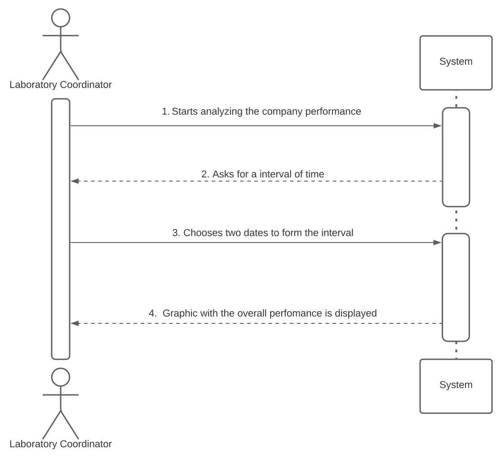

US016- Display the overall performance of ManyLabs

## 1. Requirements Engineering

The laboratory coordinator must be able to check all the tests available in the system and analyze them, using for that purpose the best algorithm that provides the information desired.

### 1.1. User Story Description

As a laboratory coordinator, I want to have an overview of all the tests performed 
by Many Labs and analyse the overall performance of the company (for instance, check 
the sub-intervals in which there were more samples waiting for the result). To facilitate 
overall analysis, the application should also display statistics and graphs.

### 1.2. Customer Specifications and Clarifications

The laboratory coordinator should introduce two dates that define an interval, the beginning date and the end date. This interval will be used to find the contiguous subsequence with maximum sum.

### 1.3. Acceptance Criteria

While evaluating the performance the laboratory 
coordinator should have the ability to dynamically select the algorithm to be 
applied from the ones available on the system (the benchmark algorithm provided
in moodle and the brute-force algorithm to be developed). Support for easily 
adding other similar algorithms is required.

### 1.4. Found out Dependencies

As this US intends to show every test performed, it is related to many USs, as one register the test, one regist the sample, one writes the report, etc. However, if we want to establish one dependency of this US, the most suitable is definitely US04, because it is the first where the test is created. As such, if there's no test created, there's no sample, there's no report, and so on, so without US04, US16 doesn't exist.

### 1.5 Input and Output Data

**Input Data:**

 * Selected data:

  **Algorithm to be chosen

  **First date of the interval to be analyzed

  **Second date of the interval to be analyzed

**Output Data:**

  *List of Tests
   * Graphics and Statistics regarding the tests.
  
### 1.6. System Sequence Diagram (SSD)

### 1.7 Other Relevant Remarks

After the previous US to register the tests and its data, this US is extremely important in a way that a overall view could be seen by the laboratory coordinator, as well the overall performance of the company.
## 2. OO Analysis

### 2.1. Relevant Domain Model Excerpt

### 2.2. Other Remarks

No remarks in this section.

## 3. Design - User Story Realization

### 3.1. Rationale

**The rationale grounds on the SSD interactions and the identified input/output data.**

| Interaction ID | Question: Which class is responsible for... | Answer  | Justification (with patterns)  |
|:-------------  |:--------------------- |:------------|:---------------------------- |
| Step 1  		 |							 |             |                              |
| Step 2  		 |							 |             |                              |
| Step 3  		 |							 |             |                              |
| Step 4  		 |							 |             |                              |
| Step 5  		 |							 |             |                              |
| Step 6  		 |							 |             |                              |              

### Systematization ##

According to the taken rationale, the conceptual classes promoted to software classes are: 

 * Class1
 * Class2
 * Class3

Other software classes (i.e. Pure Fabrication) identified: 
 * TestOverviewUI  
 * TestOverviewController

### 3.2. Sequence Diagram (SD)

### 3.3. Class Diagram (CD)

## 4. Tests

    @Test
    void BruteForceAlgorithmTrue() {
        List<Integer> Array = new ArrayList<>();
        Array.addAll(Arrays.asList(1, -2, 3, -4, 5, -6, 7, -8));
        int expresult = 6;
        int result = instance.BruteForceAlgorithm(Array);
        assertEquals(expresult, result);
    }

    @Test
    void BruteForceAlgorithm2True() {
        List<Integer> Array = new ArrayList<>();
        Array.addAll(Arrays.asList(1, -2, 3, -4, 5, -6, 7, -8));
        List expresult = new ArrayList();
        expresult.addAll(Arrays.asList(7));
        List result = instance.BruteForceAlgorithm2(Array);
        assertEquals(expresult, result);
    }

    @Test
    void DaysDifference() {
        Date firstdate = new Date(2020, 7, 10);
        Date seconddate = new Date(2020, 7, 15);
        long expresult = 5;
        long result = instance.DaysDifference(firstdate, seconddate);
        assertEquals(expresult, result);
    }

    @Test
    void ReturnYear() {
        String date = "10/07/2016";
        int expresult = 2016;
        int result = instance.ReturnYear(date);
        assertEquals(expresult, result);
    }

    @Test
    void ReturnMonth() {
        String date = "10/07/2016";
        int expresult = 7;
        int result = instance.ReturnMonth(date);
        assertEquals(expresult, result);
    }

    @Test
    void ReturnDay() {
        String date = "10/07/2016";
        int expresult = 10;
        int result = instance.ReturnDay(date);
        assertEquals(expresult, result);
    }

    @Test
    void validateDate2true(){
        String date="10/07/2016";
        boolean expresult=true;
        boolean result= instance.validateDate2(date);
        assertEquals(expresult,result);
    }

    @Test
    void validateDate() {
        String date = "10/07/2016";
        boolean expresult = true;
        boolean result = instance.validateDate(date);
        assertEquals(expresult, result);
    }

    @Test
    void validateTimeCohesion() {
        Date firstdate = new Date(2020, Calendar.OCTOBER, 2);
        Date seconddate = new Date(2020, Calendar.OCTOBER, 4);
        boolean expresult = true;
        boolean result = instance.ValidateTimeCohesion(firstdate, seconddate);
        assertEquals(expresult, result);
    }

## 5. Construction (Implementation)

    public int BruteForceAlgorithm(List<Integer> array) {

        int somamaxima = Integer.MIN_VALUE, valoresdoarray = 0;

        for (int i = 0; i < array.size(); i++) {
            valoresdoarray = valoresdoarray + array.get(i);
            if (somamaxima < valoresdoarray) {
                somamaxima = valoresdoarray;
            }
            if (valoresdoarray < 0) {
                valoresdoarray = 0;
            }
        }
        return somamaxima;
    }
    public List<Integer> BruteForceAlgorithm2(List<Integer> array) {

        int somamaxima = Integer.MIN_VALUE, valoresdoarray = 0, valormaximo = Integer.MIN_VALUE, start = 0, end = 0, s = 0;

        for (int i = 0; i < array.size(); i++) {
            if (array.get(i) > valormaximo) {
                valormaximo = array.get(i);
            }
        }
        List<Integer> valoresdasoma = new ArrayList<>(array.size());
        for (int i = 0; i < array.size(); i++) {
            valoresdoarray = valoresdoarray + array.get(i);
            if (somamaxima < valoresdoarray) {
                somamaxima = valoresdoarray;
                start = s;
                end = i;
            }
            if (valoresdoarray < 0) {
                valoresdoarray = 0;
                s = i + 1;
            }
        }
        if (somamaxima <= 1) {
            valoresdasoma.removeAll(valoresdasoma);
            valoresdasoma.add(valormaximo);
        }
        if (somamaxima > 1) {
            for (int j = start; j < end + 1; j++) {
                valoresdasoma.add(array.get(j));
            }
        }

        return valoresdasoma;
    }

## 6. Integration and Demo

To analyze the performance of the company, I implemented two algorithms, one to give the maximum sum and one to return the numbers that made that sum possible.

## 7. Observations

In order to check the performance in a more appealing and visual way, there was a graphic interface implemented to show the graphic with the intervals of time in the X axis and the difference between the tests created and the results given in that period of time in the y axis. To complement this information, there is also a pop up with the values of the maximum sum, and the values of the array that constitute it.