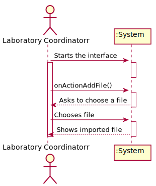
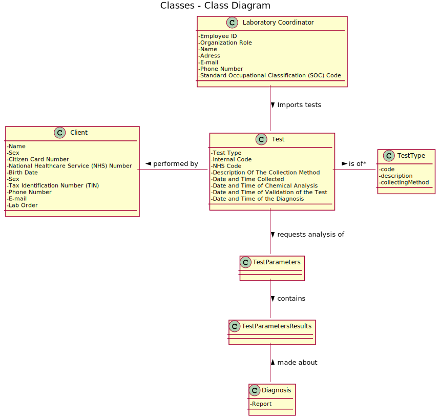
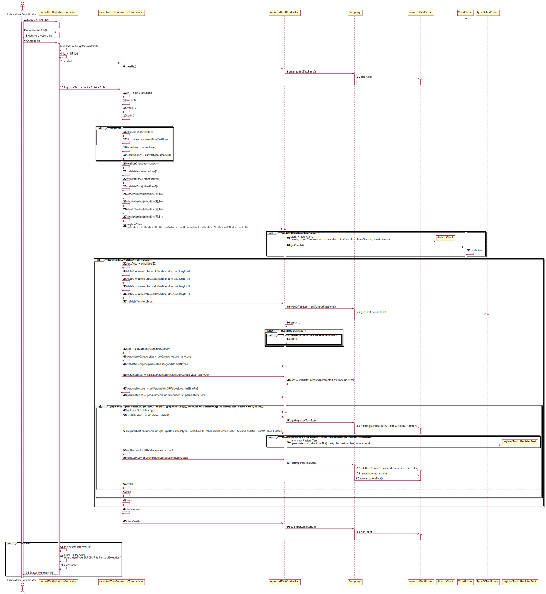
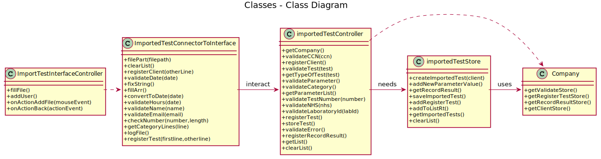

# US 017 - Import clinical tests

## 1. Requirements Engineering

### 1.1. User Story Description

As a laboratory coordinator, I want to import clinical tests from a CSV file and store all the information
of clients tests and results. The system will just ask for file path and the program will use the file data
to store tests.

### 1.2. Customer Specifications and Clarifications 

**From the specifications document:**

>	There are none for this US

**From the client clarifications:**

> **Question:** : In what folder should the CSV file be when we want to use the application through the console?
>  
> **Answer:** : In this sprint each team should develop a graphical user interface. The file to import can be located in any folder. The user should specify the path of the file.

-

> **Question:** Previously you said that “we can have more categories and parameters for each type of test.” regarding the format of the .csv files. Then, my understanding is that between the TestType and Test_Reg_DateHour columns, the number of columns is dynamic, correct? Could we end up seeing a Category_3, a Category_4, and so on?
>  
> **Answer:** Yes.

-

> **Question:** On the same issue, if there was, let’s say, a Urine type of test, would we also see some of its own categories and parameters reflected on the .csv file, as we see, for instance, N/A COVID categories on .csv files with only BLOOD type of tests?
>  
> **Answer:** Yes.

-

> **Question:** Up until now, we haven’t had any need to assign an address to a client. Seeing that there is now an Address column, that for us is somewhat left unused, would you advise us to add it as an attribute to the Client entity?
>  
> **Answer:** Yes. The address should have no more than 90 characters. Please consider the address of the Employee to have the same format that I am suggesting now for the client's address. In the beginning of the project I said that the address of the Employee should have no more than 30 characters but with this size we can not write a normal UK address.

### 1.3. Acceptance Criteria

* **AC1:** File must be csv
* **AC2:** If the file contains invalid data, that data should not be load into the system and an exception should be thrown.
* **AC3:** File information must be stored on the specific stores

### 1.4. Found out Dependencies

* There is a dependency to "US002 Register a client", "US004 Register a test" and "US012 Record a Test Result" since we will use it to store the object on there stores.

### 1.5 Input and Output Data

**Input Data:**

* Typed data:
	* File path 
	
* Selected data:
	* (none) 

**Output Data:**

* All Registered Tests
* (In)Success of the operation

### 1.6. System Sequence Diagram (SSD)

**Other alternatives might exist.**

### 1.7 Other Relevant Remarks

* This User Story is used every time Laboratory Coordinator wants to import a file of Client Tests.

## 2. OO Analysis

### 2.1. Relevant Domain Model Excerpt 

### 2.2. Other Remarks

n/a

## 3. Design - User Story Realization 

### 3.1. Rationale

| Interaction ID | Question: Which class is responsible for... | Answer  | Justification (with patterns)  |
|:-------------  |:--------------------- |:------------|:---------------------------- |
| Step 1  		 |	... interacting with the actor? | ImportTestInterfaceController   |  Pure Fabrication: there is no reason to assign this responsibility to any existing class in the Domain Model.           |
| 			  		 |	... coordinating the US? | ImportedTestConnectorToInterface | Controller                             |
| 			  		 |	... choosing file to be imported? | ImportTestInterfaceController   | Responsible for Laboratory Coordinator interactions.  |
| Step 2  		 |							 |             |                              |
| Step 3  		 |	...importing tests? | ImportedTestConnectorToInterface  | It has the job to import the tests, beeing connected to interface  |
| Step 4  		 |	... validating all data (local validation)?? | importedTestController  | importedTestController will validate all data. |
| 			  		 |	... validating all data (global validation)? | Company | knows all its Clients,Laboratories and tests.| 
| 			  		 |	... saving the imported tests? | importedTestStore | importedTestStoreowns all its imported Tests.| 
| Step 5  		 |	... saving all new tests and clients? | importedTestStore  | From imported tests info, importedTestStore will start saving all imported information |
| Step 6  		 |							 |             |                              |              
| Step 7  		 |	... informing operation success?| ImportTestInterfaceController  | ImportTestInterfaceController is responsible for user interactions.  | 

### Systematization ##

According to the taken rationale, the conceptual classes promoted to software classes are: 

 * Company
 * importedTestStore
 * importedTest

Other software classes (i.e. Pure Fabrication) identified: 

 * ImportTestInterfaceController 
 * ImportedTestConnectorToInterface
 * importedTestController

## 3.2. Sequence Diagram (SD)

## 3.3. Class Diagram (CD)

# 4. Tests 

**Test 1:** Check that it is not possible to Register a Client or a Test without valid information

	@Test
    	void registerClient() {
        	String[] all = new String[14];
        	for(int i=0;i<all.length;i++){
            		all[i]="25/10/2001";
            		all[i]="25/10/2001 13:55";

        	}
        	assertFalse(importedTestConnectorToInterface.registerClient(all));
    	}

    	@Test
    	void registerTest() {
        	String[] all = new String[14];
        	for(int i=0;i<all.length;i++){
            		all[i]="25/10/2001";
            		all[i]="25/10/2001 13:55";

        	}
        	assertFalse(importedTestConnectorToInterface.registerTest(all,all));
    	}
	

**Test 2:** Check that is not possible to save a not validated imported test

	 @Test
    	void validateTestNumber() {
        	assertTrue(importedTestController.validateTestNumber("hello"));
    	}

    	@Test
    	void validateNHS() {
        	assertTrue(importedTestController.validateNHS("hello"));
    	}

    	@Test
    	void validateLaboratoryId() {
        	assertFalse(importedTestController.validateLaboratoryId("hello"));
    	}

    	@Test
    	void registerTest() {
        	List<Parameter> parameterList = new ArrayList<>();
        	parameterList.add(new Parameter("blood","blood","blood"));
        	assertFalse(importedTestController.registerTest(parameterList,new TypeOfTest("b","b","b"),"12345678","12345678","123"));
    	}

    	@Test
    	void getRt() {
        	assertNull(importedTestController.getRt());
    	}

    	@Test
    	void addRt() {
        	Date data = new Date(2000, Calendar.NOVEMBER,2);
        	List<Parameter> parameterList = new ArrayList<>();
        	parameterList.add(new Parameter("blood","blood","blood"));
        	importedTestController.setRt(new RegisterTest(parameterList,Long.parseLong("1"),new TypeOfTest("blood","blood","blodd"),"1","1","1"));
        	assertTrue(importedTestController.addRt(data,data,data,data));
    	}

    	@Test
    	void getClient() {
        	assertNull(importedTestController.getClient());
    	}

    	@Test
    	void storeTest() {
        	assertTrue(importedTestController.storeTest());
    	}

**Test 3:** Check that its not possible to register a test if its already registered or if laboratoryid doesnt exist

	@Test
    	void validateTestNumber() {
        	assertTrue(importedTestController.validateTestNumber("000000000000003023"));
    	}

    	@Test
    	void validateNHS() {
        	assertTrue(importedTestController.validateNHS("1234567891"));
    	}

    	@Test
    	void validateLaboratoryId() {
        	assertFalse(importedTestController.validateLaboratoryId("abc57"));
    	}

*It is also recommended to organize this content by subsections.* 

# 5. Construction (Implementation)

## Class importedTestController 

		public boolean registerClient(String name, double citizenCardNumber, double nhsNumber, String birthDate, double tin, double phoneNumber, String email, String adress) {
        		client = new Client(name, citizenCardNumber, nhsNumber, birthDate, tin, phoneNumber, email, adress);
        		if (validateCCN(citizenCardNumber)) {
            		//client = new Client(name, citizenCardNumber, nhsNumber, birthDate, tin, phoneNumber, email,adress);
            		//System.out.println("Client exists");
            		return false;
        		} else {
            		//client = new Client(name, citizenCardNumber, nhsNumber, birthDate, tin, phoneNumber, email,adress);
            		ClientStore.getClients().add(client);
            		//System.out.println("Client Registered");
            		return true;
        		}
    		}

## Class importedTestStore

		public boolean addToListRt() {//MEXE SÓ NESTE MÉTODO NA CENA DO AUTH
        		for (importedTest x : importedTests) {
            			RecordResultStore.getTestResultsWithTests().add(x.getRecordResult());
            			//Files.encrypt("RecordResultStore.ser",RecordResultStore.getTestResultsWithTests());
            			RegisterTestStore.getRegisterTestList().add(x.getRecordResult().getTest());
            			//Files.encrypt("RegisterTestStore.ser",RegisterTestStore.getRegisterTestList());
            			Validate validate = new Validate(x.getRecordResult().getTest());//adicionar diagrama
            			validate.setTestResults(x.getRecordResult());//adicionar diagrama
            			validate.setValidateDate(x.getRecordResult().getTest().getTest_Validation_DateHour());//adicionar diagram
            			company.getValidateStore().getValidateList().add(validate);//adicionar diagrama
            			//Files.encrypt("ValidateStoreDone.ser",company.getValidateStore().getValidateList());
            			//System.out.println(x.getRecordResult().getTest().getTestnumber());
        		}
        		return true;
    		}

## Class ImportTestInterfaceController

		public ObservableList<User> fillFile() {
        		tableView.getItems().clear();
        		importedTestConnectorToInterface.clearList();
        		importedTestList = importedTestConnectorToInterface.filePart(filePath);
        		list = FXCollections.observableArrayList();
        		for (importedTest x :importedTestList) {
            		list.add(new User(x.toStringClient(),x.toStringRecordResult()));
        		}
        		return list;
    		}

## Class ImportedTestConnectorToInterface

		public List<importedTest> filePart(String path) {
        		File file = new File(path);
        		String[] firstLineArr = new String[0];
        		String firstLine;
        		String otherLine;
        		String[] otherLineArr;
        		int cont = 0;
        		int valid = 0;
        		try {
            			in = new Scanner(file);
            			while (in.hasNextLine()) {
                			if (cont == 0) {
                    				firstLine = in.nextLine();
                    				firstLineArr = convertLine(firstLine);
                    				cont++;
                			} else {
                    				otherLine = in.nextLine();
                    				otherLineArr = convertLine(otherLine);
                    				if (registerClient(otherLineArr)) {
                        				if (registerTest(firstLineArr, otherLineArr)) {
                            					logs.add("Test number: " + otherLineArr[0] + "->Name:" + otherLineArr[8] + "->" + importedTestController.getRt().getTypeOfTest().getDescription() + "->Test Registered Success\n");
                            					valid++;
                        				} else {
                            					fail++;
                        				}
                    				} else {
                        				fail++;
                    				}

                    				cont++;

                				}
            				}
        		} catch (IOException e) {
            			e.printStackTrace();
        		}
        		int total = cont - 1;
        		importedTestController.storeTest();
        		logFile();
        		if (importedTestController.getList().size() == 0) {
            			logs.clear();
            			logs.add("That File was already imported or its not an accepted file");
        		}
        		return importedTestController.getList();
    		}

# 6. Integration and Demo 

A new option in the Laboratory Coordinator menu has been added ("Import Tests") *Code has been added to the other US to complete this US, Import Tests

# 7. Observations

This US017 could be more optimized if the US responsible for sending an email to client with credentials was more optimized.

