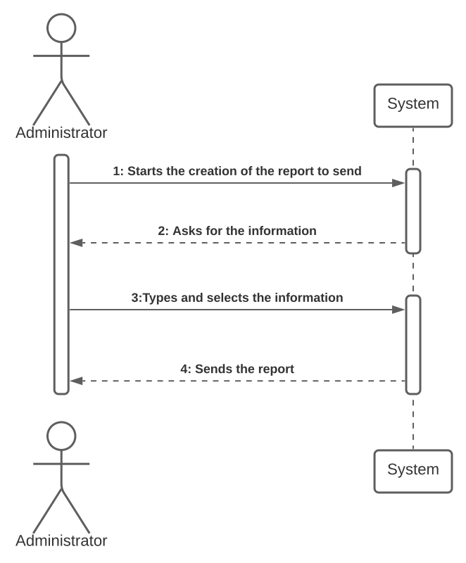
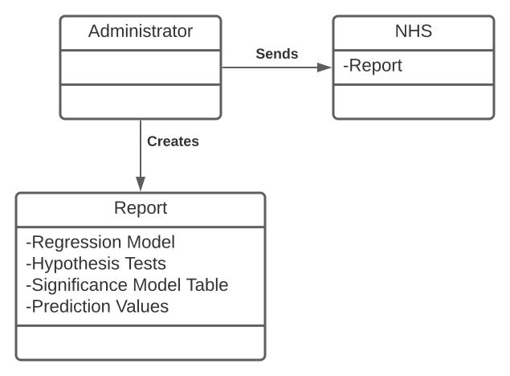
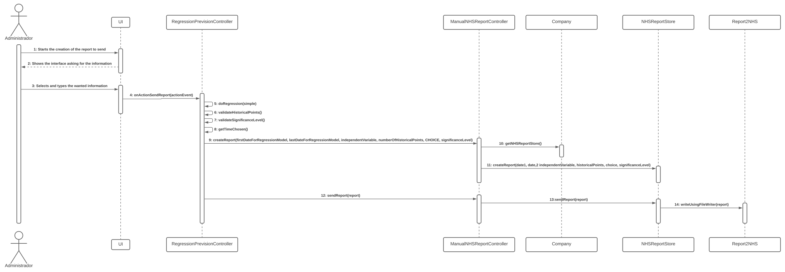
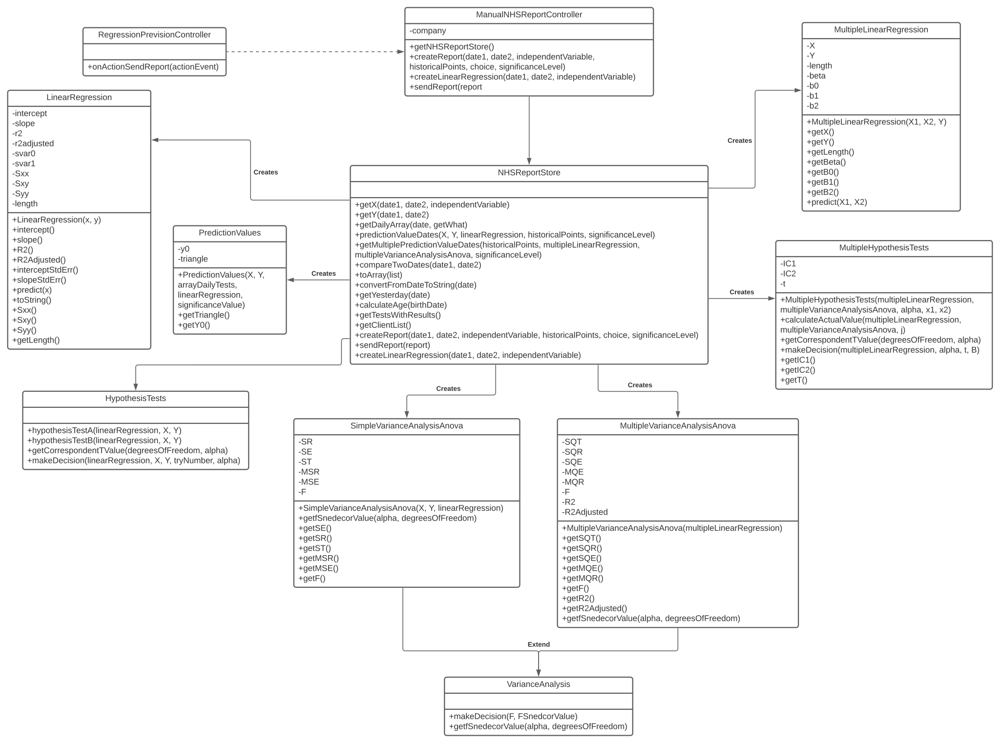

# US 18 - Sending Covid-19 reports as an Administrator

## 1. Requirements Engineering

This US' objective is for the administrator to be able to send a report to the NHS containing some information about the Covid-19 tests and their results. Here, the administrator is able to specify the two dates from where in between the information to be used in the estimation to be gathered from, the type of model to be made and some other statistics related to the calculations.

### 1.1. User Story Description

As an Administrator I want to send the Covid-19 report to the NHS at any time. I want to define the interval of dates to fit the regression model, the number of historical points (number of days or number of weeks) that must be sent to the NHS, the regression model to use and select the independent variables to use.

### 1.2. Customer Specifications and Clarifications 

In the creation of the report the user should be able to specify the significance level for the predictions and for the hypothesis tests to be made.

### 1.3. Acceptance Criteria

* The system should allow the Administrator to select between a simple linear and multilinear regression model to fit the data. Moreover, the Administrator should be able to choose the independent variable to use with the simple linear regression model (either the number of tests realized or the mean age). The system should send the report using the NHS API (available in moodle).

### 1.4. Found out Dependencies

This US depends on the US3 to get the client's age, US4 to get the ammount of registered Covid-19 tests and US12 to access the registed test's results.

### 1.5 Input and Output Data

* Typed Data:
	* Interval of dates
    * Number of historical points
    * Significance level
	
* Selected data:
	* Regression model to use
    * Independent variables

**Output Data:**

 * There is no output data, the report is sent
 

### 1.6. System Sequence Diagram (SSD)

### 1.7 Other Relevant Remarks

This US should be able to send the reports with the data selected by the user, it can be held as much times as needed or wanted by the administrator.

## 2. OO Analysis

### 2.1. Relevant Domain Model Excerpt 

### 2.2. Other Remarks

There are no other remarks.

## 3. Design - User Story Realization 

### 3.1. Rationale

**The rationale grounds on the SSD interactions and the identified input/output data.**

| Interaction ID | Question: Which class is responsible for... | Answer  | Justification (with patterns)  |
|:-------------  |:--------------------- |:------------|:---------------------------- |
|Step 1|... interacting with the user?|RegressionPrevisionController|This class is the only one that has the interface to communicate with the user|
||... coordinating the US?|ManualNHSReportController|This class has access to the Store where the information is sent and retrieved from|
|Step 2||||
|Step 3|... collecting the information typed and selected from the user?|RegressionPrevisionController|This class has the duty to interact with the user and get the information from him|
|Step 4|... using the information to get the data and create the report|ManualNHSReport|This class is responsible for creating the report and sending it to the NHS|

### Systematization ##

According to the taken rationale, the conceptual classes promoted to software classes are: 

 * LinerarRegression
 * PredictionValues
 * HypothesisTests
 * SimpleVarianceAnalysisAnova
 * MultipleVarianceAnalysisAnova
 * MultipleHypothesisTests
 * MultipleLinearRegression

Other software classes (i.e. Pure Fabrication) identified: 
 * RegressionPrevisionController  
 * ManualNHSReportController
 * NHSReportStore

## 3.2. Sequence Diagram (SD)

## 3.3. Class Diagram (CD)

# 4. Tests 

**Test 1:** Compares two given dates and returns 0 if they are equal, -1 if the second is bigger than the 1st and 1 if the 1st is bigger than the 1st

	 @Test
    public void compareTwoDates() {
        Date date1 = new Date(121, 2, 1);
        Date date2 = new Date(121, 2, 1);
        int realAnswer = store.compareTwoDates(date1, date2);
        int expectedAnswer = 0;
        assertEquals(expectedAnswer, realAnswer);
    }

# 5. Construction (Implementation)

*In this section, it is suggested to provide, if necessary, some evidence that the construction/implementation is in accordance with the previously carried out design. Furthermore, it is recommeded to mention/describe the existence of other relevant (e.g. configuration) files and highlight relevant commits.*

*It is also recommended to organize this content by subsections.* 

# 6. Integration and Demo 

*In this section, it is suggested to describe the efforts made to integrate this functionality with the other features of the system.*

# 7. Observations

*In this section, it is suggested to present a critical perspective on the developed work, pointing, for example, to other alternatives and or future related work.*

